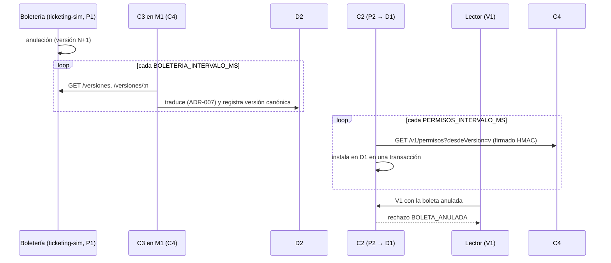

# RN-06: ventana de propagación de anulaciones (T23)

RN-06 dice que la precarga de permisos en el recinto **no acredita conocer
anulaciones posteriores**. Este documento describe cómo llega una anulación
desde la boletería hasta C2 y cuál es la ventana en la que C2 todavía no la
conoce.

## Recorrido



1. **Boletería → C3 (P1)**. C3 consulta `GET /versiones` y descarga las
   versiones nuevas en orden. Traduce localidades a zonas, descarta los datos
   del comprador y registra una versión canónica en D2 por cada cambio
   efectivo. Cada importación queda en la tabla de solo adición
   `m1_config_permisos.importaciones_boleteria`. Si la boletería reescribe o
   retrocede una versión ya importada, C3 lo trata como **conflicto** y no
   importa nada más hasta que alguien lo revise.
2. **C4 → C2 (P2)**. C2 consulta `GET /v1/permisos?desdeVersion=<versión D1>`
   y verifica la firma. Luego aplica el lote en D1 en una sola transacción: es
   idempotente, rechaza retrocesos y huecos, y nunca cambia el estado del
   evento. Cada sincronización correcta actualiza `evento.permisos_recibidos_en`.
3. **Decisión**. El motor de C2 rechaza la boleta con `BOLETA_ANULADA` si
   `anulacion_recibida_en` es anterior o igual al instante de la solicitud. C2
   sigue siendo la única autoridad: ni la boletería ni C4 deciden ingresos.

## Tamaño de la ventana

| Tramo | Variable | Predeterminado |
|---|---|---|
| Sondeo de C3 a la boletería | `BOLETERIA_INTERVALO_MS` (C4) | 5 000 ms |
| Sondeo de C2 a P2 | `PERMISOS_INTERVALO_MS` (C2) | 5 000 ms |
| Latencia de red y transacción | — | < 1 s en el laboratorio |

Con los valores predeterminados, la ventana es de **≤ ~11 s** en el peor caso
y de unos 5 s en promedio, siempre que C4 y la boletería estén disponibles. Si
se cae el enlace C2 ↔ C4 o la boletería, la ventana crece sin límite hasta que
el enlace vuelve. Ese es precisamente el caso que RN-06 advierte.

## Comportamiento dentro de la ventana

- Una boleta anulada que aún no llega a D1 **se autoriza** si cumple las demás
  reglas. Así funciona el modo local, y la bitácora lo deja trazable.
- Una boleta que ya se consumió **sigue consumida**. La anulación solo se
  aplica hacia adelante y no revierte decisiones pasadas (bitácora de solo
  adición).
- La evidencia E1 lleva `version_permisos` y `antiguedad_permisos_s`. Con ellas,
  C4 y la auditoría saben con qué versión de permisos decidió C2 y qué tan
  vieja era. `antiguedad_permisos_s` se calcula desde el último
  `permisos_recibidos_en`, así que crece cuando P2 deja de responder.

## Cómo reproducirlo

Con `npm run dev` arriba, la boletería corre en `TICKETING_PORT` (8082) y C4
recibe `BOLETERIA_URL`. Para anular en vivo:

```powershell
npm run anular -w @nexo/ticketing-sim -- TA-8800-0005
```

En menos de ~11 s, una validación V1 de esa boleta devuelve `BOLETA_ANULADA`.
La prueba automática es
`tests/integration/ticketing/anulacion-extremo.test.ts`: usa Testcontainers,
anula en la boletería y comprueba el rechazo en C2.
