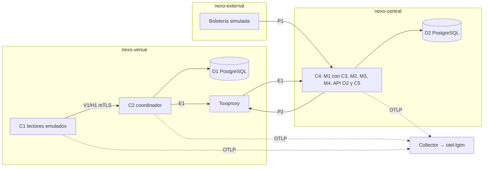

# Informe del taller 3 de NEXO: implementación, observabilidad y análisis de fallos

Curso ST1625. Entregable 3 (tareas T61 y T62, con primer pase de T64). Borrador del 25 de septiembre de 2026, sobre `main` en `968c955` (PR #27).

Este informe sigue el orden de la rúbrica de [taller3.md §1](../context/taller3.md): aplicación, observabilidad, fallos y patrones, seguidos de la autoevaluación. Cada afirmación remite a un archivo del repositorio, a un PR o a una evidencia versionada. Los PR se citan con su número y el SHA corto de su *squash* en `main`, obtenidos con `gh pr view`.

Marcadores usados:

- **PENDIENTE-T57**: depende de los experimentos F1–F4 en Minikube (T51–T54) y de su análisis (T57), que aún no están en [docs/fault-experiments/](../fault-experiments/README.md). Los completa la orquestadora.
- **PENDIENTE-DIGEST**: digests de imágenes que no se pueden calcular sin Docker ni Minikube ([matriz §2](../coherencia/matriz.md)).

La plantilla de LaTeX del taller 2 que recomienda [taller3.md §8](../context/taller3.md) (pregunta 6) no está en el repositorio. Este Markdown es la fuente del informe y puede transcribirse a esa plantilla sin cambiar su contenido.

## 1. Aplicación

### 1.1 Arquitectura desplegada

La PoC reproduce en contenedores la arquitectura de implementación del taller 2 (T2 §5.1). Minikube es el laboratorio de fallos ([ADR-015](../decisions/ADR-015-laboratorio-local-minikube.md)) y Docker Compose queda solo para `npm run dev` ([docker-compose.dev.yml](../../deploy/compose/docker-compose.dev.yml)).

| Componente | Responsabilidad | Código | Despliegue (namespace, manifiesto) |
|---|---|---|---|
| C1 lector de puerta | Lector emulado con diario durable, `idOrigen` estable, latido H1 y perfiles de carga; no decide | [src/reader-client/](../../src/reader-client/index.ts) (`src/reader-client/application/lector-emulado.ts`, `src/reader-client/infrastructure/diario-jsonl.ts`) | `nexo-venue`, [reader-load-job.yaml](../../deploy/kubernetes/application/reader-load-job.yaml) |
| C2 coordinador local | Única autoridad de validación del recinto: V1, H1, outbox y despacho E1 | [src/local-coordinator/](../../src/local-coordinator/main.ts); motor compartido en [src/shared/domain/](../../src/shared/domain/motor.ts) | `nexo-venue`, [coordinator-deployment.yaml](../../deploy/kubernetes/application/coordinator-deployment.yaml) |
| D1 persistencia local | PostgreSQL 16, instancia propia del recinto | [migraciones D1](../../src/local-coordinator/infrastructure/db/migrations/001_initial.sql) | `nexo-venue`, [d1-statefulset.yaml](../../deploy/kubernetes/data/d1-statefulset.yaml) |
| C4 núcleo central | Monolito modular con M1–M4 y API O2 con SSE | [src/central-core/](../../src/central-core/api/rutas/stream.ts) | `nexo-central`, [central-deployment.yaml](../../deploy/kubernetes/application/central-deployment.yaml) |
| C3 adaptador de boletería | Traduce P1 al modelo canónico dentro de M1 | [importador-boleteria.ts](../../src/central-core/modules/configuration-permissions/application/importador-boleteria.ts) | Dentro de C4 |
| C5 panel de operación | Prototipo del entregable 07 portado y servido por C4, con datos reales | `src/central-core/web/` | Dentro de C4 |
| D2 persistencia central | PostgreSQL 16 compartido, un esquema por módulo | [migraciones D2](../../src/central-core/infrastructure/db/migrations/001_initial.sql) | `nexo-central`, [d2-statefulset.yaml](../../deploy/kubernetes/data/d2-statefulset.yaml) |
| Boletería simulada | Sistema externo de prueba (P1 y anulaciones) | [src/ticketing-sim/](../../src/ticketing-sim/main.ts) | `nexo-external`, [ticketing-deployment.yaml](../../deploy/kubernetes/application/ticketing-deployment.yaml) |
| Toxiproxy | Punto de inyección en el enlace recinto-central | — | `nexo-venue`, [toxiproxy-deployment.yaml](../../deploy/kubernetes/application/toxiproxy-deployment.yaml) |
| Observabilidad | Collector OTel con cola persistente y `grafana/otel-lgtm` | [observability/collector/](../../observability/collector/values-local.yaml) | `nexo-observability`, [otel-lgtm.yaml](../../deploy/kubernetes/observability/otel-lgtm.yaml), [otel-collector-pvc.yaml](../../deploy/kubernetes/observability/otel-collector-pvc.yaml) |

Los namespaces por frontera de confianza se definen en [namespaces.yaml](../../deploy/kubernetes/namespaces/namespaces.yaml). [networkpolicies.yaml](../../deploy/kubernetes/application/networkpolicies.yaml) restringe el tráfico a los flujos de T2 §5.2. El despliegue se compone con [kustomization.yaml](../../deploy/kubernetes/kustomization.yaml) y se levanta con [up.mjs](../../deploy/scripts/up.mjs) (PR #20, `a8e9d00`). La ejecución paso a paso está en el [README](../../README.md) y el guion del video, en [guion-video.md](../demo/guion-video.md) (PR #26, `fc74c1e`).

### 1.2 Módulos de C4

Cada módulo tiene sus capas `domain`, `application`, `infrastructure` y `api` (G07). Una regla de [eslint.config.js](../../eslint.config.js) impide que un módulo importe el `infrastructure/` de otro.

| Módulo | Carpeta | Función implementada | PR |
|---|---|---|---|
| M1 configuración y permisos, con C3 | [configuration-permissions/](../../src/central-core/modules/configuration-permissions/application/servicio-permisos.ts) | Versiones de permisos firmadas para P2 e importación P1 desde la boletería | #11 (`e9e959c`), #15 (`888fefe`) |
| M2 ingesta de evidencia | [evidence-ingestion/](../../src/central-core/modules/evidence-ingestion/application/index.ts) | Recepción idempotente de lotes E1, proyección de puntos y de intentos del diario, incidente "Puerta sin comunicación" a los 60 s | #23 (`be8c9d3`) |
| M3 conciliación | [reconciliation/](../../src/central-core/modules/reconciliation/application/index.ts) | Cierre preliminar y definitivo, diferencias | #18 (`dff043a`) |
| M4 contratación y liquidación | [contracting-settlement/](../../src/central-core/modules/contracting-settlement/domain/index.ts) | Tarifa I(N) = 500 + 0,40 N con `decimal.js`, plazos y recompra | #4 (`e89429c`), #18 (`dff043a`) |

### 1.3 Datos

- **D1** ([001_initial.sql](../../src/local-coordinator/infrastructure/db/migrations/001_initial.sql)): la tabla `consumo` tiene la restricción `consumo_unico` sobre la clave de consumo y un `id_origen` único. `bitacora` tiene el disparador `bitacora_solo_adicion`, `outbox` tiene `UNIQUE (evento_id, tipo, id_origen)` y `lote_diario` recibe los lotes H1.
- **D2** ([001_initial.sql](../../src/central-core/infrastructure/db/migrations/001_initial.sql)): esquemas `m1_config_permisos`, `m2_evidencia`, `m3_conciliacion`, `m4_liquidacion` y `auth`, con su propio disparador `bitacora_solo_adicion`. Las importaciones de la boletería también son de solo adición ([020_c3_importaciones_boleteria.sql](../../src/central-core/infrastructure/db/migrations/020_c3_importaciones_boleteria.sql)).
- Semilla con los nombres del prototipo: [seed.sql](../../src/local-coordinator/infrastructure/db/seed/seed.sql) y [seed.ts](../../deploy/scripts/seed.ts).

### 1.4 Contratos

Los contratos V1, H1, E1, P1, P2, O2 y la autenticación del panel se definen como esquemas zod en [src/shared/contracts/](../../src/shared/contracts/index.ts) y se documentan en [contracts.md](../architecture/contracts.md). Las pruebas de forma están en `tests/unit/contracts/`. Ningún contrato lleva datos de identidad del portador ([ADR-006](../decisions/ADR-006-datos-sin-identidad-portador.md), [matriz §1](../coherencia/matriz.md)).

### 1.5 ADR implementados

La [matriz de coherencia](../coherencia/matriz.md) (T60, PR #26) cruza cada ADR con su código, su prueba y su experimento. En resumen:

| Estado en [docs/decisions/](../decisions/README.md) | ADR | Evidencia principal |
|---|---|---|
| Aceptado | 001, 003, 004, 006, 014, 015, 016 | Fronteras de ESLint; `UNIQUE` de D1 y EXP 03/04; disparadores de solo adición; Node 24 en CI; manifiestos de Minikube; login con argon2 |
| Pendiente de PoC, con evidencia parcial | 002, 011 | [f1-c2-degradacion-2026-09-25.md](../evidence/load/f1-c2-degradacion-2026-09-25.md): C2 valida con C4 caído y drena el diario (§4.2) |
| Pendiente de PoC | 005, 007, 008, 010, 012, 013 | Pruebas de integración de C3, mTLS, revocación y esquema; falta la PoC en Minikube (PENDIENTE-T57 para 005, 012 y 013) |
| Recortado en el taller 3 | 009 | Sin RLS en D2 (§7) |

### 1.6 Pruebas automatizadas

- `npm test` en esta rama: 29 archivos y 224 pruebas aprobadas (Vitest, ejecución del 25-09-2026). CI ejecuta `npm ci`, `npm run lint` y `npm test` en Node 24 ([ci.yml](../../.github/workflows/ci.yml)).
- T11: la trazabilidad PU/PB → prueba y la cobertura del motor (100 % de sentencias en `motor.ts` y 96,47 % en `validar-primer-ingreso.ts`) están en [T11.md](../evidence/unit-tests/T11.md).
- Las pruebas de integración con Testcontainers están en `tests/integration/` (coordinador, D1/D2, C3 y mTLS). No se ejecutaron en esta sesión porque S3-experimentos tiene reservado el Docker compartido.

### 1.7 Interfaz C5

La comparación pantalla por pantalla con el prototipo (T32) está en [docs/evidence/ui/README.md](../evidence/ui/README.md), con capturas pareadas. El panel no tiene simulador ni dock de demostración. En esa revisión se corrigieron textos residuales que mencionaban "la simulación" y un estado "Cargando…" permanente en puertas sin lector (PR #14, `d880455`). T31 (vista `#/lector` contra C2) sigue en curso según [taller3.md §5](../context/taller3.md).

## 2. Observabilidad

### 2.1 Instrumentación y canalización (T40)

- C1, C2 y C4 usan el SDK de OpenTelemetry que inicializa [src/shared/telemetry/](../../src/shared/telemetry/index.ts) (PR #17, `852eabc`).
- El Collector usa `file_storage` en un PVC, `sending_queue.storage` y `retry_on_failure` con `max_elapsed_time: 0`, para no descartar telemetría durante caídas largas del backend ([values-local.yaml](../../observability/collector/values-local.yaml), PR #22, `2efd319`). Exporta a `otel-lgtm`; la exportación a Grafana Cloud es opcional ([values-grafana-cloud.yaml](../../observability/collector/values-grafana-cloud.yaml)).
- Limitación: E1 no transporta `traceparent`, así que no hay Span Link real entre C2 y C4 ([matriz §3](../coherencia/matriz.md), recorte a).

### 2.2 Métricas N1–N3 y T1–T3 (T41, T43)

La justificación completa de cada métrica (decisión que soporta, KR o CA, SLO y ADR) está en [justificacion-metricas.md](../observability/justificacion-metricas.md). Resumen:

| ID | Métrica | Instrumento OTel | SLO |
|---|---|---|---|
| N1 | Admisiones e ingreso facturable | `nexo_c2_validaciones_total{decision="aceptado",admision="true"}`, `nexo_c4_registros_evidencia_total` | Informativa, conciliada al cierre |
| N2 | Disponibilidad del flujo de validación | `nexo_c2_validaciones_total{decision}`, `nexo_c1_resultados_total{decision}` | ≥ 99,9 % |
| N3 | Integridad | `nexo_c4_lotes_evidencia_total{resultado="conflicto"}` (indicador indirecto) | 0 y 0 |
| T1 | Latencia de validación | `nexo_c2_validacion_duracion_ms`, `nexo_c1_validacion_duracion_ms` | ≥ 95 % en ≤ 300 ms; p95 ≤ 500 ms |
| T2 | Pendientes de sincronización | `nexo_c2_outbox_pendientes`, `nexo_c2_outbox_edad_maxima_s` | ≥ 99,5 % drenado en 5 min |
| T3 | Errores técnicos y sin respuesta | `nexo_c2_errores_total{causa}` | Informativa; alerta si consume el presupuesto de N2 |

Como apoyo se exporta `nexo_c2_latido_edad_s`, que alimenta A8 ([latidos.ts](../../src/local-coordinator/application/latidos.ts)). Las métricas llegan a Grafana desde el PR #27 (`968c955`); ver §5.2.

### 2.3 Tableros y alertas (T41, T42)

- Tableros como código ([README](../../observability/dashboards/README.md)): [operacion-del-evento.json](../../observability/dashboards/operacion-del-evento.json) muestra N1, N2 y T1; [sincronizacion-y-resiliencia.json](../../observability/dashboards/sincronizacion-y-resiliencia.json) muestra T2, N3 y T3.
- Alertas en [alertas-t42.yaml](../../observability/alerts/alertas-t42.yaml): A1 (consumo duplicado o conflicto), A6 (latencia), A8 (punto sin comunicación más de 60 s), A11 (outbox crítico), A13 (cola del Collector sobre el 80 %) y A14 (telemetría descartada). Notifican a un webhook local ([webhook-receptor.mjs](../../observability/alerts/webhook-receptor.mjs)).
- Capturas de las alertas disparadas durante F1–F4: **PENDIENTE-T57**.

## 3. Simulación y análisis de fallos (F1–F4)

El diseño de los escenarios está en [taller3.md §3.1](../context/taller3.md). Los experimentos se declaran en `chaos/experiments/` y se ejecutan con `nexo-chaos` ([nexo-chaos.ts](../../chaos/scripts/nexo-chaos.ts), PR #9, `cc67630`; ajustes de F2 y F4 en el PR #19, `5fbda2e`). La única ejecución versionada hasta ahora es un ensayo en seco de RED-01 ([cdd6c0e8….json](../../chaos/evidence/cdd6c0e8-1637-46de-bb30-93999944b0f3.json), `"dryRun": true`), que no es evidencia de resultado.

Cada experimento se documenta con la escala de T2 §11.3: hipótesis, perturbación, métricas, recuperación, resultado y aprendizaje.

| Fallo | Tipo | Experimento | Resultado y análisis |
|---|---|---|---|
| F1 RED-01, corte recinto-central | Red | [red-01-central-connection](../../chaos/experiments/red-01-central-connection/README.md) | **PENDIENTE-T57** → [docs/fault-experiments/](../fault-experiments/README.md) |
| F2 SER-06, caída de observabilidad | Servicio | [ser-06-observability-outage](../../chaos/experiments/ser-06-observability-outage/README.md) | **PENDIENTE-T57** → [docs/fault-experiments/](../fault-experiments/README.md) |
| F3 BD-01, D1 indisponible | Base de datos | [bd-01-local-persistence](../../chaos/experiments/bd-01-local-persistence/README.md) | **PENDIENTE-T57** → [docs/fault-experiments/](../fault-experiments/README.md) |
| F4 REC-01, CPU del coordinador | Recursos | [rec-01-coordinator-cpu](../../chaos/experiments/rec-01-coordinator-cpu/README.md) | **PENDIENTE-T57** → [docs/fault-experiments/](../fault-experiments/README.md) |

### 3.1 F1 — RED-01

- Hipótesis: [taller3.md §3.1](../context/taller3.md).
- Perturbación, métricas (N1, T2 y N3), recuperación y resultado: **PENDIENTE-T57**.
- Antecedente fuera del arnés: C2 con C4 inaccesible (§4.2).

### 3.2 F2 — SER-06

- Hipótesis: [taller3.md §3.1](../context/taller3.md).
- Perturbación (escalar `otel-lgtm` a 0; [matriz §3](../coherencia/matriz.md), recorte d), cola del Collector, alertas A13 y A14, recuperación y resultado: **PENDIENTE-T57**.

### 3.3 F3 — BD-01

- Hipótesis: [taller3.md §3.1](../context/taller3.md).
- Perturbación, N2, T3, integridad tras la recuperación y resultado: **PENDIENTE-T57**.

### 3.4 F4 — REC-01

- Hipótesis: [taller3.md §3.1](../context/taller3.md).
- Perturbación (límite de CPU de C2), T1, A6, integridad y resultado: **PENDIENTE-T57**.

### 3.5 Conclusiones de los fallos

**PENDIENTE-T57**.

## 4. Resultados de carga e integridad ya medidos

### 4.1 Carga C1 → C2 → D1 (T24)

Fuente: [t24-2026-09-25.md](../evidence/load/t24-2026-09-25.md) (PR #6, `6e51102`; reenvío en el PR #16, `5b64ea0`). Son corridas cortas contra un D1 aislado, sin C4.

| Corrida | TPS observado | ≤ 300 ms | p95 | Aceptaciones C1 / D1 |
|---|---:|---:|---:|---:|
| Nominal, 150 s | 5,50 | 99,88 % | 88,3 ms | 626 / 626 |
| Pico, 60 lectores, sin pruebas paralelas | 49,49 | 99,43 % | 127,4 ms | 613 / 613 |
| Pico, 60 lectores, con pruebas paralelas | 49,40 | 73,43 % | 574,2 ms | 613 / 613 |
| Pico, 20 lectores, con pruebas paralelas | 49,49 | 89,66 % | 745,8 ms | 555 / 593 |

Conclusiones que sostiene la evidencia:

- En aislamiento, T1 se cumple en nominal y en pico.
- Con otras suites de pruebas en el Docker compartido, T1 no se cumple. La evidencia lo registra como una diferencia observada, no como una causa demostrada.
- Que el lector reciba un *timeout* no prueba que D1 no haya decidido. En el pico de 20 lectores, D1 confirmó 38 aceptaciones que C1 no recibió.
- Al reenviar esas 38 decisiones se obtuvo la decisión original (`repetida=true`) sin consumos nuevos, lo que demuestra la idempotencia por `idOrigen` sobre el transporte real.
- Límite: no se ensayaron los perfiles completos de una hora ni los tres eventos.

### 4.2 C2 con C4 caído (antecedente de F1)

Fuente: [f1-c2-degradacion-2026-09-25.md](../evidence/load/f1-c2-degradacion-2026-09-25.md) (PR #21, `8ea8638`). Con C4 inaccesible, 20 lectores y 49,5 TPS:

- Antes de la corrección, el 74,6 % de las respuestas llegó en ≤ 300 ms.
- Después, llegó el 100 %, con p95 de 50 ms.
- La prueba de regresión `tests/integration/coordinator/f1-degradacion.test.ts` pasó del 2,4 % al 100 % y drenó en 20 s los 10 000 registros del diario H1, sin dobles consumos.

El diagnóstico está en §5.1.

### 4.3 Integridad EXP 03 y EXP 04 (T55)

Fuente: [integridad-exp03-exp04.test.ts](../../tests/resilience/integridad-exp03-exp04.test.ts) y su [README](../../tests/resilience/README.md) (PR #7, `7f1db2b`).

- **EXP 03**: tras perder la respuesta y reiniciar C2, el mismo `idOrigen` devuelve la decisión original con `repetida: true`, sin duplicar intento, consumo, bitácora ni outbox. Un contenido distinto con el mismo `idOrigen` es un conflicto.
- **EXP 04**: 500 boletas leídas a la vez por dos lectores producen 500 consumos, 500 aceptaciones, 500 rechazos (`USO_CONCURRENTE` o `USO_YA_REGISTRADO`) y 1000 intentos.

## 5. Hallazgos de producto encontrados al probar

### 5.1 P0: V1 fuera de plazo con C4 caído (PR #21, `8ea8638`)

- **Síntoma**: con C4 inaccesible, 0 de 2970 V1 respondieron en ≤ 300 ms y el p95 fue de 2747 ms ([t24-2026-09-25.md](../evidence/load/t24-2026-09-25.md), última exploración).
- **Causa demostrada**: C4 no era la causa. Había dos problemas en C2 y D1:
  1. Una fila caliente en `boleta`. El perfil pico dirige el 65 % de las lecturas a boletas usadas y un D1 recién sembrado solo tiene una, así que todas esas V1 competían por el mismo `FOR UPDATE`, retenido hasta el fsync del commit.
  2. Los lotes H1 ocupaban el mismo pool de conexiones que V1.
- **Corrección**: cuando el único resultado posible es un rechazo, la boleta se lee sin candado ([unidad-postgres.ts](../../src/local-coordinator/infrastructure/persistence/postgres/unidad-postgres.ts)). H1, E1 y las versiones usan un pool de fondo propio, y los lotes se procesan por conjuntos ([almacen-postgres.ts](../../src/local-coordinator/infrastructure/persistence/postgres/almacen-postgres.ts)). El `UNIQUE` de `consumo` sigue siendo la garantía de consumo único.
- **Evidencia**: [f1-c2-degradacion-2026-09-25.md](../evidence/load/f1-c2-degradacion-2026-09-25.md), tablas A y B.

### 5.2 Métricas OTel que no se exportaban y *buckets* sin 300 ms (PR #27, `968c955`)

- `metrics.getMeter()` se ejecutaba al importar cada módulo, antes de `iniciarTelemetria`. Como la API de métricas de OpenTelemetry no tiene proveedor proxy, los instrumentos quedaban sin efecto (*no-op*) para siempre. Además, el punto de entrada de Docker de C2 ([index.ts](../../src/local-coordinator/index.ts)) no iniciaba la telemetría.
- **Corrección**: medidores diferidos que se enlazan de nuevo cuando se registra el proveedor ([src/shared/telemetry/index.ts](../../src/shared/telemetry/index.ts), prueba [metricas-diferidas.test.ts](../../src/shared/telemetry/metricas-diferidas.test.ts)).
- Los histogramas usaban los límites por omisión, que no incluyen 300 ms, así que T1 no se podía calcular. Se agregaron los límites `LIMITES_LATENCIA_MS`. En los tableros y en A6 también se corrigió el nombre que exporta Prometheus (`*_duracion_ms_milliseconds_bucket`).
- El mismo PR agregó la salida OTLP a las NetworkPolicies, el secreto de firma P2 de C2 y `enableServiceLinks: false` en el receptor de alertas.
- Consecuencia: las pruebas unitarias no detectaron las métricas sin efecto porque no comprobaban la exportación real (§8.2).

### 5.3 Lote E1 envenenado por latidos con `idOrigen` repetido (PR #28, `3ffb913`)

El mecanismo, según el código de `main` en `968c955` (antes de la corrección):

1. C2 forma el `idOrigen` de un latido como `${lectorId}:latido:${secuencia}` ([latidos.ts](../../src/local-coordinator/application/latidos.ts), `tomarPendientes`). Si la secuencia vuelve a empezar tras un reinicio, se reutiliza con otro contenido un `idOrigen` que D2 ya había recibido.
2. M2 compara el *hash* de contenido de cada registro. Si difiere, lanza `ConflictoEvidencia` y rechaza el lote completo ([evidence-ingestion/infrastructure/index.ts](../../src/central-core/modules/evidence-ingestion/infrastructure/index.ts)).
3. El despachador E1 conserva el lote pendiente y lo reenvía idéntico en cada ciclo; solo lo descarta ante un 413 ([despachador-outbox.ts](../../src/local-coordinator/application/despachador-outbox.ts), `procesarCiclo`). Las decisiones que viajan en ese lote nunca reciben acuse, y el outbox (T2) deja de drenar.

Diagnóstico en Minikube (26-09, 03:56Z, durante la preparación de F1):

- C2 registraba `Fallo de envío E1 … HTTP 409` con `fallosConsecutivos` creciente, y C4 respondía 409 a cada reintento.
- En D1 había 991 filas de outbox: 708 con acuse y 283 que nunca drenaban.
- En D2 solo aparecían los latidos `…:latido:1..3` de la primera carga.
- La causa fue cada nuevo Job de carga, que reinicia la secuencia del lector.

Corrección (PR #28, `3ffb913`):

- El `idOrigen` del latido incluye el instante del lector: `${lectorId}:latido:${secuencia}:${instanteLector}` (`idOrigenLatido` en [latidos.ts](../../src/local-coordinator/application/latidos.ts)). Es estable entre reintentos y distinto tras un reinicio.
- Ante un 409 con latidos, el despachador los retira y deja constancia en D1: tabla `latido_descartado`, migración [041](../../src/local-coordinator/infrastructure/db/migrations/041_c2_latido_descartado.sql), solo de adición. También registra un log `warn` y la métrica `nexo_c2_e1_latidos_descartados`. El siguiente lote viaja solo con decisiones ([despachador-outbox.ts](../../src/local-coordinator/application/despachador-outbox.ts), `descartarLatidos`).
- Un 409 con solo decisiones sigue bloqueando y alertando, porque es un conflicto de integridad real.
- Si no se puede registrar la constancia en D1, el lote no se descarta.
- Pruebas: [latidos-id-origen.test.ts](../../tests/unit/coordinator/latidos-id-origen.test.ts) y [despachador-outbox.test.ts](../../tests/unit/coordinator/despachador-outbox.test.ts).
- Verificación tras redesplegar en Minikube:
  - las 283 filas drenaron (991/991 con acuse);
  - dos cargas seguidas con reinicio del lector dejaron 1651 filas de outbox, 0 pendientes, 0 respuestas 409 y 0 latidos descartados.

### 5.4 Falso positivo de A1

- Hasta el PR #28, A1 se calculaba como `sum(increase(nexo_c4_lotes_evidencia_total{resultado="conflicto"}[24h]))` ([alertas-t42.yaml](../../observability/alerts/alertas-t42.yaml)).
- En `ServicioIngestaEvidencia.procesarLote`, cualquier excepción durante la persistencia incrementa ese contador con `resultado: 'conflicto'` ([evidence-ingestion/application/index.ts](../../src/central-core/modules/evidence-ingestion/application/index.ts)), no solo `ConflictoEvidencia`.
- Por eso el lote envenenado de §5.3 dispara A1 en cada reintento, aunque no haya ningún doble consumo. Un error de D2 también la dispararía.
- El carácter indirecto de esta medida ya estaba documentado como limitación ([justificacion-metricas.md](../observability/justificacion-metricas.md); [matriz §3](../coherencia/matriz.md), recorte b). La integridad real se verifica por SQL (§4.3).
- Disparo observado: durante el diagnóstico de §5.3, el contador llegó a 12 conflictos en 5 minutos sin ningún doble consumo.
- Corrección (PR #28, `3ffb913`):
  - C4 etiqueta el contador con `tipo`: el de `ConflictoEvidencia`, o `desconocido` para cualquier otra excepción.
  - A1 y el panel N3 cuentan solo `tipo="decision"`, tanto en [alertas-t42.yaml](../../observability/alerts/alertas-t42.yaml) como en los tableros y los ConfigMaps de Kubernetes.
- Un error de D2 ya no dispara A1, porque queda como `tipo="desconocido"`.

## 6. Patrones utilizados

La base es [taller3.md §6](../context/taller3.md); cada fila se confirmó en el código.

| Patrón | Atributo de calidad | ADR | Archivo(s) del repositorio |
|---|---|---|---|
| Capas y monolito modular | Mantenibilidad | [001](../decisions/ADR-001-estilo-capas-monolito-modular.md) | `src/central-core/modules/<modulo>/{domain,application,infrastructure,api}`; fronteras en [eslint.config.js](../../eslint.config.js) |
| Puertos y adaptadores | Mantenibilidad, testabilidad | 001, [007](../decisions/ADR-007-modelo-canonico-ingesta.md) | [puertos.ts](../../src/shared/domain/puertos.ts) (`UnidadValidacion`); adaptadores [unidad-postgres.ts](../../src/local-coordinator/infrastructure/persistence/postgres/unidad-postgres.ts) y [almacen-memoria.ts](../../src/local-coordinator/infrastructure/persistence/memoria/almacen-memoria.ts) |
| Autoridad única con consumo atómico | Integridad | [002](../decisions/ADR-002-validacion-sincrona-coordinador-local.md), [003](../decisions/ADR-003-consumo-atomico-unico-ingreso.md) | `consumo_unico` en [D1 001_initial.sql](../../src/local-coordinator/infrastructure/db/migrations/001_initial.sql); [motor.ts](../../src/shared/domain/motor.ts) |
| Receptor idempotente por `idOrigen` | Confiabilidad | 002, [011](../decisions/ADR-011-validacion-sincrona-sincronizacion-recuperable.md) | [validar-primer-ingreso.ts](../../src/shared/domain/validar-primer-ingreso.ts); M2 en [evidence-ingestion/infrastructure/index.ts](../../src/central-core/modules/evidence-ingestion/infrastructure/index.ts) |
| Bitácora de solo adición | Auditabilidad | [004](../decisions/ADR-004-bitacora-solo-adicion.md) | Disparador `bitacora_solo_adicion` en [D1](../../src/local-coordinator/infrastructure/db/migrations/001_initial.sql) y [D2](../../src/central-core/infrastructure/db/migrations/001_initial.sql) |
| Outbox transaccional y *store-and-forward* | Disponibilidad ante particiones | 011 | Tabla `outbox` en D1; [despachador-outbox.ts](../../src/local-coordinator/application/despachador-outbox.ts) |
| Diario durable en el cliente | Recuperabilidad | 011 | [diario-jsonl.ts](../../src/reader-client/infrastructure/diario-jsonl.ts); `lote_diario` en D1 |
| Adaptador anticorrupción | Interoperabilidad | 007 | [importador-boleteria.ts](../../src/central-core/modules/configuration-permissions/application/importador-boleteria.ts) (C3 en M1) |
| Reintento con *backoff* exponencial y *jitter*; prioridad de V1 | Rendimiento de la validación | 011 | [despachador-outbox.ts](../../src/local-coordinator/application/despachador-outbox.ts); [prioridad.ts](../../src/local-coordinator/application/prioridad.ts) (`ContadorV1`) |
| *Bulkhead* (pools separados para V1 y para el trabajo de fondo) | Rendimiento, aislamiento de fallos | 002, 011 | [almacen-postgres.ts](../../src/local-coordinator/infrastructure/persistence/postgres/almacen-postgres.ts) (PR #21) |
| Heartbeat y *health check* | Observabilidad, recuperabilidad | KR1.2 | [latidos.ts](../../src/local-coordinator/application/latidos.ts); `UMBRAL_SIN_COMUNICACION_MS` en [evidence-ingestion/domain/index.ts](../../src/central-core/modules/evidence-ingestion/domain/index.ts); *probes* en [coordinator-deployment.yaml](../../deploy/kubernetes/application/coordinator-deployment.yaml) |
| Proyección de lectura y difusión SSE | Rendimiento, disponibilidad | SER-05 | Proyecciones de M2 en D2; [stream.ts](../../src/central-core/api/rutas/stream.ts) y [hub.ts](../../src/central-core/api/stream/hub.ts) |
| Collector como agente con cola persistente | Observabilidad desacoplada | [013](../decisions/ADR-013-observabilidad-extremo-a-extremo.md) | [values-local.yaml](../../observability/collector/values-local.yaml) |
| Confianza por mTLS con credencial revocable | Seguridad | [008](../decisions/ADR-008-identidad-dispositivos.md) | [tls.ts](../../src/local-coordinator/api/tls.ts); [reemplazo-lector.ts](../../src/local-coordinator/application/reemplazo-lector.ts) (PR #10, `1f54946`; PR #24, `0eb3327`) |

## 7. Recortes y desviaciones

Resumen del registro de recortes de la [matriz §3](../coherencia/matriz.md) y de [taller3.md §7](../context/taller3.md):

| # | Recorte o desviación | Resolución |
|---|---|---|
| a | E1 sin `traceparent`: no hay Span Link C2→C4 | Sin resolver; se propone un campo opcional en `RegistroEvidencia` |
| b | N3 y A1 se miden con un indicador indirecto (`resultado="conflicto"`) | Aceptado y documentado; §5.4 muestra su falso positivo |
| c | ConfigMaps de tableros y alertas copiados a mano desde `observability/` | Sin resolver; deuda técnica |
| d | F2 corta la exportación escalando `otel-lgtm` a 0, porque `kindnet` no aplica NetworkPolicies de egreso | Adoptado (G06, ADR-013) |
| e | Vistas de `#/preparacion` y CA1–CA4 sin fuente de datos real completa | En curso (T31) |
| f | Repositorio de conciliación de M3 en ajuste | En curso; el código no muestra marcas de stub |
| g, h | README de subcarpetas desactualizados | README raíz resuelto en el PR #26; el resto queda para T64 |
| — | RLS en D2 no implementado | [ADR-009](../decisions/ADR-009-aislamiento-cliente-evento.md), recortada |
| — | Sin D3 (MinIO): D2 retiene los 90 días | [ADR-012](../decisions/ADR-012-persistencia-auditoria-recuperacion.md) |
| — | Digests de imágenes sin calcular | **PENDIENTE-DIGEST** ([matriz §2](../coherencia/matriz.md)) |

## 8. Autoevaluación (T62)

### 8.1 Logros

- Las cinco piezas y las dos bases de datos funcionan de punta a punta, en los namespaces previstos. Los invariantes de consumo único, idempotencia, bitácora de solo adición y outbox están respaldados por restricciones y disparadores de base de datos (§1.3, §6).
- La integridad se demostró bajo concurrencia y reintentos (EXP 03 y EXP 04, §4.3) y reenviando decisiones reales que se habían quedado sin respuesta (§4.1).
- Antes del experimento formal se encontró y corrigió, con evidencia A/B, un P0 de disponibilidad: la validación local se mantiene dentro de plazo sin C4 (§5.1).
- Las seis métricas, los dos tableros y las seis alertas están versionados como código y justificados (§2).
- La [matriz](../coherencia/matriz.md) traza cada ADR hasta su código y su prueba, y las desviaciones quedaron registradas.

### 8.2 Dificultades

- **Entorno compartido y contención de Docker.** Varias sesiones comparten Docker Desktop y Minikube ([AGENTS.md](../../AGENTS.md), "Entorno compartido"). Las corridas de pico con otras suites de Testcontainers en paralelo bajaron T1 al 73–90 % ([t24-2026-09-25.md](../evidence/load/t24-2026-09-25.md)), y el muestreo con `docker stats` alteró las mismas mediciones que pretendía observar. La reserva exclusiva del clúster para F1–F4 impidió cerrar en esta sesión los digests, las pruebas de NetworkPolicy en el clúster y las pruebas de integración.
- **Mensajes contradictorios y estado desactualizado entre agentes.** La matriz registra README que describían como pendientes tareas ya hechas (recortes g y h), y tareas que dos sesiones daban por "en curso" sin rastro en el código (recorte f). Los botones "Prueba un caso" de `#/lector` quedaron bloqueados en una pregunta a la orquestadora sobre la ruta del panel hacia C2 ([docs/evidence/ui/README.md](../evidence/ui/README.md), §04). Se dedicó tiempo a reconciliar versiones distintas del estado.
- **Métricas sin efecto que nadie detectó.** Las pruebas unitarias pasaban mientras ninguna métrica llegaba a Prometheus y los histogramas no permitían medir 300 ms (§5.2). El problema solo apareció al preparar F1–F4 en Minikube, justo antes de los experimentos.
- **Hallazgos que solo aparecen en ciertas condiciones.** La fila caliente (§5.1) solo aparece con un D1 recién sembrado, y el lote envenenado y el falso positivo de A1 (§5.3, §5.4), solo tras un reinicio. Ninguno se ve en corridas cortas sobre datos acumulados.

### 8.3 Propuestas de evolución

1. Añadir a CI una prueba de humo de telemetría que exporte a un receptor OTLP en memoria y compruebe que N1–N3 y T1–T3 tienen datos y que existe el *bucket* `le="300"`. Así no se repetiría §5.2.
2. En E1, aceptar los registros válidos de un lote e informar el conflicto por registro, en lugar de rechazar el lote completo. Además, derivar el `idOrigen` del latido de un identificador estable por arranque del lector (§5.3).
3. En C4, separar el contador de conflictos de idempotencia del de errores técnicos, y alimentar A1 con una consulta SQL periódica de boletas con más de un consumo (§5.4).
4. Propagar `traceparent` en E1 para crear el Span Link C2→C4 (recorte a).
5. Generar los ConfigMaps de observabilidad desde `observability/` con un script de `deploy/scripts/` (recorte c).
6. Ejecutar los perfiles completos de una hora y tres eventos en un entorno de carga dedicado, sin otras sesiones (§4.1).
7. Fijar las imágenes por digest y retomar RLS (ADR-009) cuando haya más de un cliente.
8. Para el trabajo con agentes: un único tablero de estado que solo escriba la orquestadora, reservas de Docker y Minikube con hora de fin explícita, y comprobar en el código lo que afirma otra sesión antes de propagarlo.

## 9. Pendientes del informe

| Marcador | Sección | Quién lo cierra |
|---|---|---|
| PENDIENTE-T57 | §2.3 (capturas de alertas), §3, §3.1–§3.5 | Orquestadora, con los resultados de S3-experimentos |
| PENDIENTE-DIGEST | §7 | Sesión con acceso a Minikube ([matriz §2](../coherencia/matriz.md)) |

## Anexo A. Verificación de enlaces (T64)

Los enlaces relativos de este informe se comprueban con `node scripts/check-links.mjs --code-paths docs/informe`. El script no tiene dependencias y verifica:

- que exista el archivo de cada enlace relativo de Markdown;
- que exista el encabezado cuando el enlace apunta a un ancla `#…` de un archivo `.md`;
- con `--code-paths`, que existan las rutas del repositorio citadas entre comillas invertidas.
