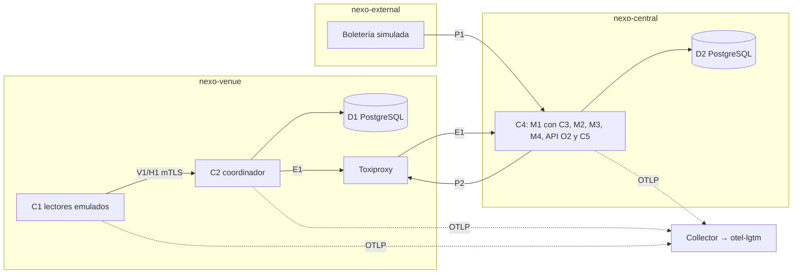

# Informe del taller 3 de NEXO: implementación, observabilidad y análisis de fallos

Curso ST1625. Entregable 3 (tareas T61, T62 y T64). Versión final del 26 de septiembre de 2026, sobre `main` en `01aeb86` (PR #35). El borrador anterior se escribió sobre `968c955` (PR #27, publicado en el PR #29, `3d8685f`).

Este informe sigue el orden de la rúbrica de [taller3.md §1](../context/taller3.md): aplicación, observabilidad, fallos y patrones, seguidos de la autoevaluación. Cada afirmación remite a un archivo del repositorio, a un PR o a una evidencia versionada. Los PR se citan con su número y el SHA corto de su *squash* en `main`, obtenidos con `gh pr view`.

Marcador usado:

- **PENDIENTE-DIGEST**: digests de imágenes que no se pueden calcular sin Docker ni Minikube ([matriz §2](../coherencia/matriz.md)).

Los resultados de F1–F4 (T51–T54), su evidencia (T56) y su análisis (T57) están en [docs/fault-experiments/](../fault-experiments/README.md) y [chaos/evidence/](../../chaos/evidence/README.md) desde el PR #35 (`01aeb86`).

La plantilla de LaTeX del taller 2 que recomienda [taller3.md §8](../context/taller3.md) (pregunta 6) no está en el repositorio. Este Markdown es la fuente del informe y puede transcribirse a esa plantilla sin cambiar su contenido.

## 1. Aplicación

### 1.1 Arquitectura desplegada

La PoC reproduce en contenedores la arquitectura de implementación del taller 2 (T2 §5.1). Minikube es el laboratorio de fallos ([ADR-015](../decisions/ADR-015-laboratorio-local-minikube.md)) y Docker Compose queda solo para `npm run dev` ([docker-compose.dev.yml](../../deploy/compose/docker-compose.dev.yml)).

| Componente | Responsabilidad | Código | Despliegue (namespace, manifiesto) |
|---|---|---|---|
| C1 lector de puerta | Lector emulado con diario durable, `idOrigen` estable, latido H1 y perfiles de carga; no decide | [src/reader-client/](../../src/reader-client/index.ts) (`src/reader-client/application/lector-emulado.ts`, `src/reader-client/infrastructure/diario-jsonl.ts`) | `nexo-venue`, [reader-load-job.yaml](../../deploy/kubernetes/application/reader-load-job.yaml) |
| C2 coordinador local | Única autoridad de validación del recinto: V1, H1, outbox y despacho E1 | [src/local-coordinator/](../../src/local-coordinator/main.ts); motor compartido en [src/shared/domain/](../../src/shared/domain/motor.ts) | `nexo-venue`, [coordinator-deployment.yaml](../../deploy/kubernetes/application/coordinator-deployment.yaml) |
| D1 persistencia local | PostgreSQL 16, instancia propia del recinto | [migraciones D1](../../src/local-coordinator/infrastructure/db/migrations/001_initial.sql) | `nexo-venue`, [d1-statefulset.yaml](../../deploy/kubernetes/data/d1-statefulset.yaml) |
| C4 núcleo central | Monolito modular con M1–M4 y API O2 con SSE | [src/central-core/](../../src/central-core/api/rutas/stream.ts) | `nexo-central`, [central-deployment.yaml](../../deploy/kubernetes/application/central-deployment.yaml) |
| C3 adaptador de boletería | Traduce P1 al modelo canónico dentro de M1 | [importador-boleteria.ts](../../src/central-core/modules/configuration-permissions/application/importador-boleteria.ts) | Dentro de C4 |
| C5 panel de operación | Prototipo del entregable 07 portado y servido por C4, con datos reales | `src/central-core/web/` | Dentro de C4 |
| D2 persistencia central | PostgreSQL 16 compartido, un esquema por módulo | [migraciones D2](../../src/central-core/infrastructure/db/migrations/001_initial.sql) | `nexo-central`, [d2-statefulset.yaml](../../deploy/kubernetes/data/d2-statefulset.yaml) |
| Boletería simulada | Sistema externo de prueba (P1 y anulaciones) | [src/ticketing-sim/](../../src/ticketing-sim/main.ts) | `nexo-external`, [ticketing-deployment.yaml](../../deploy/kubernetes/application/ticketing-deployment.yaml) |
| Toxiproxy | Punto de inyección en el enlace recinto-central | — | `nexo-venue`, [toxiproxy-deployment.yaml](../../deploy/kubernetes/application/toxiproxy-deployment.yaml) |
| Observabilidad | Collector OTel con cola persistente y `grafana/otel-lgtm` | [observability/collector/](../../observability/collector/values-local.yaml) | `nexo-observability`, [otel-lgtm.yaml](../../deploy/kubernetes/observability/otel-lgtm.yaml), [otel-collector-pvc.yaml](../../deploy/kubernetes/observability/otel-collector-pvc.yaml) |

Los namespaces por frontera de confianza se definen en [namespaces.yaml](../../deploy/kubernetes/namespaces/namespaces.yaml). [networkpolicies.yaml](../../deploy/kubernetes/application/networkpolicies.yaml) restringe el tráfico a los flujos de T2 §5.2. El despliegue se compone con [kustomization.yaml](../../deploy/kubernetes/kustomization.yaml) y se levanta con [up.mjs](../../deploy/scripts/up.mjs) (PR #20, `a8e9d00`). La ejecución paso a paso está en el [README](../../README.md) y el guion del video, en [guion-video.md](../demo/guion-video.md) (PR #26, `fc74c1e`).

### 1.2 Módulos de C4

Cada módulo tiene sus capas `domain`, `application`, `infrastructure` y `api` (G07). Una regla de [eslint.config.js](../../eslint.config.js) impide que un módulo importe el `infrastructure/` de otro.

| Módulo | Carpeta | Función implementada | PR |
|---|---|---|---|
| M1 configuración y permisos, con C3 | [configuration-permissions/](../../src/central-core/modules/configuration-permissions/application/servicio-permisos.ts) | Versiones de permisos firmadas para P2 e importación P1 desde la boletería | #11 (`e9e959c`), #15 (`888fefe`) |
| M2 ingesta de evidencia | [evidence-ingestion/](../../src/central-core/modules/evidence-ingestion/application/index.ts) | Recepción idempotente de lotes E1, proyección de puntos y de intentos del diario, incidente "Puerta sin comunicación" a los 60 s | #23 (`be8c9d3`) |
| M3 conciliación | [reconciliation/](../../src/central-core/modules/reconciliation/application/index.ts) | Cierre preliminar y definitivo, diferencias | #18 (`dff043a`) |
| M4 contratación y liquidación | [contracting-settlement/](../../src/central-core/modules/contracting-settlement/domain/index.ts) | Tarifa I(N) = 500 + 0,40 N con `decimal.js`, plazos y recompra | #4 (`e89429c`), #18 (`dff043a`) |

### 1.3 Datos

- **D1** ([001_initial.sql](../../src/local-coordinator/infrastructure/db/migrations/001_initial.sql)): la tabla `consumo` tiene la restricción `consumo_unico` sobre la clave de consumo y un `id_origen` único. `bitacora` tiene el disparador `bitacora_solo_adicion`, `outbox` tiene `UNIQUE (evento_id, tipo, id_origen)` y `lote_diario` recibe los lotes H1.
- **D2** ([001_initial.sql](../../src/central-core/infrastructure/db/migrations/001_initial.sql)): esquemas `m1_config_permisos`, `m2_evidencia`, `m3_conciliacion`, `m4_liquidacion` y `auth`, con su propio disparador `bitacora_solo_adicion`. Las importaciones de la boletería también son de solo adición ([020_c3_importaciones_boleteria.sql](../../src/central-core/infrastructure/db/migrations/020_c3_importaciones_boleteria.sql)).
- Semilla con los nombres del prototipo: [seed.sql](../../src/local-coordinator/infrastructure/db/seed/seed.sql) y [seed.ts](../../deploy/scripts/seed.ts).

### 1.4 Contratos

Los contratos V1, H1, E1, P1, P2, O2 y la autenticación del panel se definen como esquemas zod en [src/shared/contracts/](../../src/shared/contracts/index.ts) y se documentan en [contracts.md](../architecture/contracts.md). Las pruebas de forma están en `tests/unit/contracts/`. Ningún contrato lleva datos de identidad del portador ([ADR-006](../decisions/ADR-006-datos-sin-identidad-portador.md), [matriz §1](../coherencia/matriz.md)).

### 1.5 ADR implementados

La [matriz de coherencia](../coherencia/matriz.md) (T60, PR #26) cruza cada ADR con su código, su prueba y su experimento. En resumen:

| Estado en [docs/decisions/](../decisions/README.md) | ADR | Evidencia principal |
|---|---|---|
| Aceptado | 001, 003, 004, 006, 014, 015, 016 | Fronteras de ESLint; `UNIQUE` de D1 y EXP 03/04; disparadores de solo adición; Node 24 en CI; manifiestos de Minikube; login con argon2 |
| Pendiente de PoC, con PoC ejecutada en Minikube | 002, 011 | F1 ([f1-red-01.md](../fault-experiments/f1-red-01.md)): C2 valida con C4 cortado y drena 1410/1410 pendientes en 15 s. El criterio del ADR pide un corte de 15 min y F1 duró 5 min (§3.1), así que el estado no cambia |
| Pendiente de PoC, con PoC ejecutada en Minikube | 005, 012, 013 | F3 ([f3-bd-01.md](../fault-experiments/f3-bd-01.md)) para 005 y 012: cero aceptaciones sin D1 y cero duplicados al volver; faltan las otras topologías y el respaldo independiente. F2 ([f2-ser-06.md](../fault-experiments/f2-ser-06.md)) para 013: 15 min sin backend con validación intacta y cola drenada; falta el Span Link C2→C4 (recorte a) |
| Pendiente de PoC | 007, 008, 010 | Pruebas de integración de C3, mTLS y revocación; ningún experimento F1–F4 las cubre |
| Recortado en el taller 3 | 009 | Sin RLS en D2 (§7) |

### 1.6 Pruebas automatizadas

- `npm test` en la rama del pase final: 31 archivos y 235 pruebas aprobadas (Vitest, ejecución del 26-09-2026). CI ejecuta `npm ci`, `npm run lint` y `npm test` en Node 24 ([ci.yml](../../.github/workflows/ci.yml)).
- T11: la trazabilidad PU/PB → prueba y la cobertura del motor (100 % de sentencias en `motor.ts` y 96,47 % en `validar-primer-ingreso.ts`) están en [T11.md](../evidence/unit-tests/T11.md).
- Las pruebas de integración con Testcontainers están en `tests/integration/` (coordinador, D1/D2, C3 y mTLS). No se ejecutaron en esta sesión porque S3-experimentos tiene reservado el Docker compartido.

### 1.7 Interfaz C5

La comparación pantalla por pantalla con el prototipo (T32) está en [docs/evidence/ui/README.md](../evidence/ui/README.md), con capturas pareadas. El panel no tiene simulador ni dock de demostración. En esa revisión se corrigieron textos residuales que mencionaban "la simulación" y un estado "Cargando…" permanente en puertas sin lector (PR #14, `d880455`). T31 se cerró con dos PR:

- PR #32 (`3f8e0c9`): `#/preparacion` escribe los controles y la confirmación de apertura en D2 (antes respondía 501), y `#/cierre` resuelve también eventos `cerrado`. CA1–CA4 muestran "No disponible todavía" porque no hay fuente real ([matriz §3](../coherencia/matriz.md), recortes e y f).
- PR #33 (`ea7725f`): `#/lector` ya no simula una validación V1. Su botón llamaba a `POST /api/lector/escaneos`, un endpoint que nunca existió; la vista ahora solo muestra intentos registrados. Validar desde el navegador exigiría una credencial de lector web en C2 que ADR-008 no contempla ([matriz §3](../coherencia/matriz.md), recorte i).

## 2. Observabilidad

### 2.1 Instrumentación y canalización (T40)

- C1, C2 y C4 usan el SDK de OpenTelemetry que inicializa [src/shared/telemetry/](../../src/shared/telemetry/index.ts) (PR #17, `852eabc`).
- El Collector usa `file_storage` en un PVC, `sending_queue.storage` y `retry_on_failure` con `max_elapsed_time: 0`, para no descartar telemetría durante caídas largas del backend ([values-local.yaml](../../observability/collector/values-local.yaml), PR #22, `2efd319`). Exporta a `otel-lgtm`; la exportación a Grafana Cloud es opcional ([values-grafana-cloud.yaml](../../observability/collector/values-grafana-cloud.yaml)).
- Limitación: E1 no transporta `traceparent`, así que no hay Span Link real entre C2 y C4 ([matriz §3](../coherencia/matriz.md), recorte a).

### 2.2 Métricas N1–N3 y T1–T3 (T41, T43)

La justificación completa de cada métrica (decisión que soporta, KR o CA, SLO y ADR) está en [justificacion-metricas.md](../observability/justificacion-metricas.md). Resumen:

| ID | Métrica | Instrumento OTel | SLO |
|---|---|---|---|
| N1 | Admisiones e ingreso facturable | `nexo_c2_validaciones_total{decision="aceptado",admision="true"}`, `nexo_c4_registros_evidencia_total` | Informativa, conciliada al cierre |
| N2 | Disponibilidad del flujo de validación | `nexo_c2_validaciones_total{decision}`, `nexo_c1_resultados_total{decision}` | ≥ 99,9 % |
| N3 | Integridad | `nexo_c4_lotes_evidencia_total{resultado="conflicto"}` (indicador indirecto) | 0 y 0 |
| T1 | Latencia de validación | `nexo_c2_validacion_duracion_ms`, `nexo_c1_validacion_duracion_ms` | ≥ 95 % en ≤ 300 ms; p95 ≤ 500 ms |
| T2 | Pendientes de sincronización | `nexo_c2_outbox_pendientes`, `nexo_c2_outbox_edad_maxima_s` | ≥ 99,5 % drenado en 5 min |
| T3 | Errores técnicos y sin respuesta | `nexo_c2_errores_total{causa}` | Informativa; alerta si consume el presupuesto de N2 |

Como apoyo se exporta `nexo_c2_latido_edad_s`, que alimenta A8 ([latidos.ts](../../src/local-coordinator/application/latidos.ts)). Las métricas llegan a Grafana desde el PR #27 (`968c955`); ver §5.2.

### 2.3 Tableros y alertas (T41, T42)

- Tableros como código ([README](../../observability/dashboards/README.md)): [operacion-del-evento.json](../../observability/dashboards/operacion-del-evento.json) muestra N1, N2 y T1; [sincronizacion-y-resiliencia.json](../../observability/dashboards/sincronizacion-y-resiliencia.json) muestra T2, N3 y T3.
- Alertas en [alertas-t42.yaml](../../observability/alerts/alertas-t42.yaml): A1 (consumo duplicado o conflicto), A6 (latencia), A8 (punto sin comunicación más de 60 s), A11 (outbox crítico), A13 (cola del Collector sobre el 80 %) y A14 (telemetría descartada). Notifican a un webhook local ([webhook-receptor.mjs](../../observability/alerts/webhook-receptor.mjs)). Desde el PR #34 (`4821be9`), A13 y A14 vigilan `nexo-otel-collector` y no el Collector interno de `otel-lgtm` (§5.6).
- Alertas durante F1–F4: el estado de las seis reglas al recolectar cada corrida está en `alertas-estado.json` de cada carpeta de [chaos/evidence/](../../chaos/evidence/README.md). Solo A8 aparece `firing` (en F1 y F3), y es ruido de arranque y parada de la carga ([fault-experiments/README.md](../fault-experiments/README.md), amenazas a la validez). Ninguna alerta asociada a un fallo se disparó:
  - A11 no disparó en F1: el umbral es `> 300 s` y la edad máxima fue de 298,98 s ([integridad.json](../../chaos/evidence/red-01-central-connection/integridad.json)).
  - A13 y A14 no pueden alertar en F2, porque Grafana muere con `otel-lgtm` (recorte j).
  - A6 no disparó en F4: la caída bajo 95 % duró ~1 min y la regla exige 2 min.
- Por eso no hay captura de una alerta de fallo disparada. El criterio de T42 ("cada alerta se dispara al menos una vez durante F1 a F4") no se cumplió para A1, A6, A11, A13 y A14. Se registra en §3.5 y en la [matriz §3](../coherencia/matriz.md). Las capturas de los paneles de cada fallo sí están versionadas (§3.1–§3.4).
- Los archivos `alertas.log` y `logs/` que describe [chaos/evidence/README.md](../../chaos/evidence/README.md) no están versionados, porque `.gitignore` excluye `*.log` y `logs/`. La fuente de las alertas es `alertas-estado.json`.

## 3. Simulación y análisis de fallos (F1–F4)

El diseño de los escenarios está en [taller3.md §3.1](../context/taller3.md). Los experimentos se declaran en `chaos/experiments/` y se ejecutan con `nexo-chaos` ([nexo-chaos.ts](../../chaos/scripts/nexo-chaos.ts), PR #9, `cc67630`; ajustes de F2 y F4 en el PR #19, `5fbda2e`). Se ejecutaron el 26-09-2026 en Minikube, de uno en uno, con carga nominal de 20 lectores a ~5,5 intentos/s. La evidencia (T56) y el análisis (T57) están en el PR #35 (`01aeb86`):

- el método común está en [fault-experiments/README.md](../fault-experiments/README.md);
- la estructura de cada carpeta de evidencia está en [chaos/evidence/README.md](../../chaos/evidence/README.md);
- el ensayo en seco previo ([cdd6c0e8….json](../../chaos/evidence/cdd6c0e8-1637-46de-bb30-93999944b0f3.json), `"dryRun": true`) no es evidencia de resultado.

Cada experimento se documenta con la escala de T2 §11.3: hipótesis, perturbación, métricas, recuperación, resultado y aprendizaje. Las cifras de integridad salen de `integridad.json` ([integridad-d1.sql](../../chaos/sql/integridad-d1.sql) e [integridad-d2.sql](../../chaos/sql/integridad-d2.sql)). Son acumuladas desde el último `reset.mjs`: F2, F3 y F4 comparten evento, así que lo que se evalúa es que duplicados, pérdidas y pendientes sigan en cero.

| Fallo | Tipo | Experimento | Resultado (T2 §11.3) | Análisis y evidencia |
|---|---|---|---|---|
| F1 RED-01, corte recinto-central | Red | [red-01-central-connection](../../chaos/experiments/red-01-central-connection/README.md) | **Aprobada** | [f1-red-01.md](../fault-experiments/f1-red-01.md), [evidencia](../../chaos/evidence/red-01-central-connection/) |
| F2 SER-06, caída de observabilidad | Servicio | [ser-06-observability-outage](../../chaos/experiments/ser-06-observability-outage/README.md) | **Aprobada con degradación prevista** | [f2-ser-06.md](../fault-experiments/f2-ser-06.md), [evidencia](../../chaos/evidence/ser-06-observability-outage/) |
| F3 BD-01, D1 indisponible | Base de datos | [bd-01-local-persistence](../../chaos/experiments/bd-01-local-persistence/README.md) | **Aprobada con degradación prevista** | [f3-bd-01.md](../fault-experiments/f3-bd-01.md), [evidencia](../../chaos/evidence/bd-01-local-persistence/) |
| F4 REC-01, CPU del coordinador | Recursos | [rec-01-coordinator-cpu](../../chaos/experiments/rec-01-coordinator-cpu/README.md) | **No concluyente** | [f4-rec-01.md](../fault-experiments/f4-rec-01.md), [evidencia](../../chaos/evidence/rec-01-coordinator-cpu/) |

### 3.1 F1 — RED-01

- **Hipótesis**: sin enlace con C4, C2 sigue validando en D1, acumula outbox E1 y drena al restaurar, sin pérdidas ni duplicados ([taller3.md §3.1](../context/taller3.md)). El taller 3 recorta T2 EXP 01 a un corte C2→C4 de 5 min.
- **Perturbación**: Toxiproxy deshabilita `c2-to-c4` durante 300 s, de 04:44:30 a 04:49:30 UTC. El registro es `64c7b936-…` ([nexo-chaos-run.json](../../chaos/evidence/red-01-central-connection/nexo-chaos-run.json)).
- **Métricas** ([metricas-resumen.json](../../chaos/evidence/red-01-central-connection/metricas-resumen.json)):
  - N2 se mantuvo al 100 % en las tres fases.
  - El p95 de T1 en C2 fue de 30,3 ms antes, 24,0 ms durante y 23,9 ms después (medias por fase). El 100 % de las validaciones quedó en ≤ 300 ms.
  - Los pendientes de T2 llegaron a 1246 durante el corte, con una edad máxima de 264,28 s.
  - Los registros por minuto de C4 bajaron de 322,67 a 49,74 durante el corte y subieron a 633,94 después (medias).
  - Capturas: [t2-pendientes.png](../../chaos/evidence/red-01-central-connection/capturas/t2-pendientes.png), [t2-edad-outbox.png](../../chaos/evidence/red-01-central-connection/capturas/t2-edad-outbox.png), [n2-disponibilidad.png](../../chaos/evidence/red-01-central-connection/capturas/n2-disponibilidad.png), [t1-p95.png](../../chaos/evidence/red-01-central-connection/capturas/t1-p95.png) y [c4-registros-min.png](../../chaos/evidence/red-01-central-connection/capturas/c4-registros-min.png).
- **Recuperación**: al restaurar había 1410 pendientes. Los 1410 tuvieron acuse en 5 min; el último llegó a las 04:49:45.203, unos 15 s después ([integridad.json](../../chaos/evidence/red-01-central-connection/integridad.json), `drenado`). Cumple el ≥ 99,5 % en 5 min de T2.
- **Integridad**: D1 registró 11332 intentos (7525 aceptados y 3807 rechazados) y 7525 consumos. Hubo 0 boletas con más de un consumo y 0 decisiones sin outbox. D2 tiene las mismas 11332 decisiones: 0 pérdidas y 0 registros sin origen en D1.
- **Alertas**: A11 no disparó, porque exige más de 300 s y la edad máxima fue de 298,98 s (§2.3).
- **Validez**: la carga agotó las boletas válidas de Palcos y el Job terminó sin `reporte.json`. Por eso [carga-resumen.json](../../chaos/evidence/red-01-central-connection/carga-resumen.json) no tiene un informe parseable (hallazgo H8 en [hallazgos.md](../fault-experiments/hallazgos.md)). La primera corrida quedó invalidada por los gauges T2 congelados; se corrigió en el PR #31 y se repitió (§5.5).
- **Resultado: aprobada.**

### 3.2 F2 — SER-06

- **Hipótesis**: la caída del backend de observabilidad no bloquea validaciones ni auditoría; el Collector encola en `file_storage` y drena al restaurar (T2 EXP 06).
- **Perturbación**: `deployment/nexo-otel-lgtm` escalado a 0 durante 900 s, de 05:12:11 a 05:27:11 UTC, con el registro `dd9f9d11-…` ([nexo-chaos-run.json](../../chaos/evidence/ser-06-observability-outage/nexo-chaos-run.json)). Es el mecanismo del recorte d.
- **Métricas**:
  - Según el lector ([lector-por-fase.txt](../../chaos/evidence/ser-06-observability-outage/lector-por-fase.txt)), el p95 fue de 35,2 ms antes, 35,2 ms durante y 39,0 ms después. El porcentaje en ≤ 300 ms fue de 99,90 %, 99,81 % y 99,45 %. Hubo 15 *timeouts* en total, 11 de ellos durante la caída.
  - Según C2 ([metricas-resumen.json](../../chaos/evidence/ser-06-observability-outage/metricas-resumen.json)), N2 se mantuvo al 100 %. Esa serie existe gracias al *replay* de la cola.
  - Capturas: [n2-disponibilidad.png](../../chaos/evidence/ser-06-observability-outage/capturas/n2-disponibilidad.png), [t1-p95.png](../../chaos/evidence/ser-06-observability-outage/capturas/t1-p95.png), [t1-pct-300ms.png](../../chaos/evidence/ser-06-observability-outage/capturas/t1-pct-300ms.png) y [t3-errores.png](../../chaos/evidence/ser-06-observability-outage/capturas/t3-errores.png).
- **Cola del Collector**: se sondeó `:8888` cada 15 s ([collector-cola.jsonl](../../chaos/evidence/ser-06-observability-outage/collector-cola.jsonl)).
  - La cola llegó a 185 lotes de métricas y 184 de trazas a las 05:27:33, sobre una capacidad de 10000 (< 2 %).
  - Llegó a 0 a las 05:28:19, unos 46 s después del máximo y unos 68 s después de la restauración.
  - Se perdió alrededor de 1 min de telemetría (05:12–05:13), probablemente enviado mientras LGTM terminaba.
- **Integridad**: [integridad.json](../../chaos/evidence/ser-06-observability-outage/integridad.json) registra 7591 decisiones en D1 y D2, 0 duplicados, 0 pérdidas y un drenado del 100 %.
- **Alertas**: no hubo notificación. Grafana, Prometheus y el motor de alertas viven dentro de `otel-lgtm`, así que mueren con él (recorte j). Además, A13 y A14 leían el Collector interno de LGTM y A14 usaba nombres sin `_total`; lo corrigió el PR #34 (§5.6).
- **Validez**: los 15 *timeouts* pueden deberse en parte a la contaminación del Docker compartido. El proyecto `nexo-dev` estuvo activo de ~04:34 a ~05:34Z (H9).
- **Resultado: aprobada con degradación prevista.** Se cumplen la validación, la integridad y el drenaje de la cola. El criterio de alerta de T52 no se cumple por un límite de diseño del laboratorio: no hay un vigilante externo.

### 3.3 F3 — BD-01

- **Hipótesis**: sin D1 durable no hay aceptaciones nuevas; C2 no reemplaza a D1 con memoria ni con C4. Es la variante de indisponibilidad de D1 de T2 EXP 05, sin los subcasos de disco lleno.
- **Perturbación**: `statefulset/nexo-d1` escalado a 0 durante 120 s, de 05:38:01 a 05:40:01 UTC, con el registro `df36a9be-…` ([nexo-chaos-run.json](../../chaos/evidence/bd-01-local-persistence/nexo-chaos-run.json)).
- **Métricas**:
  - Según el lector ([lector-por-fase.txt](../../chaos/evidence/bd-01-local-persistence/lector-por-fase.txt)), hubo 2 aceptaciones y 563 *timeouts* durante el corte, y 103 *timeouts* después: 666 en total.
  - Según C2 ([metricas-resumen.json](../../chaos/evidence/bd-01-local-persistence/metricas-resumen.json)), N2 se mantuvo al 100 % y T3 en 0 (solo aparece una serie de `plazo de validación vencido`, en 0).
  - La media del p95 de T1 en C1 fue de 24,29 ms antes, 435,05 ms durante y 114,59 ms después.
  - Capturas: [n2-disponibilidad.png](../../chaos/evidence/bd-01-local-persistence/capturas/n2-disponibilidad.png), [t1-p95.png](../../chaos/evidence/bd-01-local-persistence/capturas/t1-p95.png), [t3-errores.png](../../chaos/evidence/bd-01-local-persistence/capturas/t3-errores.png) y [c1-resultados.png](../../chaos/evidence/bd-01-local-persistence/capturas/c1-resultados.png).
- **Recuperación**: las 2 aceptaciones de la ventana se confirmaron en D1 en los primeros milisegundos del SIGTERM, así que son aceptaciones durables. D1 volvió hacia las 05:40:02 y C2 tardó unos 21 s más en reconectarse; la primera decisión nueva llegó a las 05:40:23 ([f3-bd-01.md](../fault-experiments/f3-bd-01.md)).
- **Integridad**: [integridad.json](../../chaos/evidence/bd-01-local-persistence/integridad.json) registra 10229 decisiones en D1 y D2 y 7738 consumos, con 0 duplicados y 0 pérdidas. Hay 662 evidencias `intento-diario` en D2, coherentes con los intentos que el lector no pudo completar.
- **Alertas**: no hubo ninguna útil. El readiness de C2 usa `/salud`, que no depende de D1, así que el pod siguió Ready. Además, N2 y T3 no cuentan las solicitudes que nunca llegan a decisión (§5.7).
- **Resultado: aprobada con degradación prevista.** Se sostuvo el invariante de cero aceptaciones sin D1 durable. La caída no se ve en N2, en T3 ni en el readiness; la única señal fiable es el lector.

### 3.4 F4 — REC-01

- **Hipótesis**: limitar la CPU de C2 degrada T1 de forma observable y dispara A6 (< 95 % en ≤ 300 ms durante 2 min), sin afectar la integridad. No tiene fila directa en T2 §11.3.
- **Perturbación**: el límite `cpuLimit` de `nexo-coordinator` bajó de 500m a 100m durante 300 s, de 05:51:28 a 05:56:28 UTC, con el registro `f56b65df-…` ([nexo-chaos-run.json](../../chaos/evidence/rec-01-coordinator-cpu/nexo-chaos-run.json)). No se puede bajar de 100m porque ese valor es también el *request*.
- **Métricas**:
  - Según el lector ([lector-por-fase.txt](../../chaos/evidence/rec-01-coordinator-cpu/lector-por-fase.txt)), el p95 fue de 29,4 ms antes, 65,1 ms durante y 31,5 ms después. El porcentaje en ≤ 300 ms fue de 100 %, 99,06 % y 99,90 %. Hubo 29 *timeouts* durante el límite y 6 después.
  - Según C2 ([metricas-resumen.json](../../chaos/evidence/rec-01-coordinator-cpu/metricas-resumen.json)), el p95 de T1 alcanzó un máximo de 404,5 ms. El porcentaje en ≤ 300 ms bajó hasta un mínimo del 92 % y N2 hasta un mínimo del 91 %.
  - La degradación se concentró en el *cold start* del *rollout* que provoca el cambio de límite, durante unos 1 min.
  - Capturas: [t1-p95.png](../../chaos/evidence/rec-01-coordinator-cpu/capturas/t1-p95.png), [t1-pct-300ms.png](../../chaos/evidence/rec-01-coordinator-cpu/capturas/t1-pct-300ms.png) y [n2-disponibilidad.png](../../chaos/evidence/rec-01-coordinator-cpu/capturas/n2-disponibilidad.png).
- **Integridad**: [integridad.json](../../chaos/evidence/rec-01-coordinator-cpu/integridad.json) registra 14177 decisiones en D1 y D2 y 10740 consumos, con 0 duplicados, 0 pérdidas y un drenado del 100 % (2 pendientes al restaurar, con acuse en < 1 s).
- **Alertas**: A6 no disparó, porque la caída bajo el 95 % duró ~1 min y la regla exige 2 min.
- **Resultado: no concluyente.** Se mantuvo la integridad, pero la perturbación aprobada fue demasiado leve para validar A6. El consumo nominal de C2 es de ~31m, así que 100m deja poco margen.

### 3.5 Conclusiones de los fallos

1. **Los invariantes de seguridad se sostuvieron en los cuatro fallos.** En ninguno hubo boletas con más de un consumo, decisiones perdidas entre D1 y D2 ni decisiones sin outbox (`integridad.json` de cada carpeta). C2 siguió siendo la única autoridad: validó sin C4 (F1) y dejó de aceptar sin D1 (F3).
2. **El outbox transaccional drenó dentro del SLO de T2.** En F1 drenaron 1410/1410 en 15 s. Queda la reserva de que F1 cortó 5 min y no los 15 min que piden ADR-002 y ADR-011 ([matriz §1](../coherencia/matriz.md)).
3. **La observabilidad es la parte más débil.** En ningún fallo se disparó una alerta asociada (§2.3):
   - F2 muestra que el vigilante no puede vivir dentro del sistema vigilado (recorte j).
   - F3 muestra que N2, T3 y el readiness tienen sesgo de supervivencia: no cuentan lo que nunca llega a decisión.
   - F4 no validó A6.
   - Hacen falta un *dead-man's switch* externo, un readiness de C2 que dependa de D1 o una alerta sobre la tasa de sin respuesta de C1, y una variante fuerte de F4 (§8.3).
4. **Los fallos encontraron defectos antes de dar resultados.** La primera corrida de F1 reveló los gauges T2 congelados (PR #31), y F2 reveló que A13 y A14 vigilaban otro Collector (PR #34). Ambos se corrigieron y la evidencia se recogió con el código corregido (§5.5, §5.6).
5. **Amenazas a la validez** ([fault-experiments/README.md](../fault-experiments/README.md)):
   - el laboratorio tiene un solo nodo;
   - el Docker compartido estuvo contaminado durante F1 y F2;
   - la carga consume una bolsa finita de boletas;
   - A8 genera ruido al iniciar y detener la carga.

## 4. Resultados de carga e integridad ya medidos

### 4.1 Carga C1 → C2 → D1 (T24)

Fuente: [t24-2026-09-25.md](../evidence/load/t24-2026-09-25.md) (PR #6, `6e51102`; reenvío en el PR #16, `5b64ea0`). Son corridas cortas contra un D1 aislado, sin C4.

| Corrida | TPS observado | ≤ 300 ms | p95 | Aceptaciones C1 / D1 |
|---|---:|---:|---:|---:|
| Nominal, 150 s | 5,50 | 99,88 % | 88,3 ms | 626 / 626 |
| Pico, 60 lectores, sin pruebas paralelas | 49,49 | 99,43 % | 127,4 ms | 613 / 613 |
| Pico, 60 lectores, con pruebas paralelas | 49,40 | 73,43 % | 574,2 ms | 613 / 613 |
| Pico, 20 lectores, con pruebas paralelas | 49,49 | 89,66 % | 745,8 ms | 555 / 593 |

Conclusiones que sostiene la evidencia:

- En aislamiento, T1 se cumple en nominal y en pico.
- Con otras suites de pruebas en el Docker compartido, T1 no se cumple. La evidencia lo registra como una diferencia observada, no como una causa demostrada.
- Que el lector reciba un *timeout* no prueba que D1 no haya decidido. En el pico de 20 lectores, D1 confirmó 38 aceptaciones que C1 no recibió.
- Al reenviar esas 38 decisiones se obtuvo la decisión original (`repetida=true`) sin consumos nuevos, lo que demuestra la idempotencia por `idOrigen` sobre el transporte real.
- Límite: no se ensayaron los perfiles completos de una hora ni los tres eventos.

### 4.2 C2 con C4 caído (antecedente de F1)

Fuente: [f1-c2-degradacion-2026-09-25.md](../evidence/load/f1-c2-degradacion-2026-09-25.md) (PR #21, `8ea8638`). Con C4 inaccesible, 20 lectores y 49,5 TPS:

- Antes de la corrección, el 74,6 % de las respuestas llegó en ≤ 300 ms.
- Después, llegó el 100 %, con p95 de 50 ms.
- La prueba de regresión `tests/integration/coordinator/f1-degradacion.test.ts` pasó del 2,4 % al 100 % y drenó en 20 s los 10 000 registros del diario H1, sin dobles consumos.

El diagnóstico está en §5.1.

### 4.3 Integridad EXP 03 y EXP 04 (T55)

Fuente: [integridad-exp03-exp04.test.ts](../../tests/resilience/integridad-exp03-exp04.test.ts) y su [README](../../tests/resilience/README.md) (PR #7, `7f1db2b`).

- **EXP 03**: tras perder la respuesta y reiniciar C2, el mismo `idOrigen` devuelve la decisión original con `repetida: true`, sin duplicar intento, consumo, bitácora ni outbox. Un contenido distinto con el mismo `idOrigen` es un conflicto.
- **EXP 04**: 500 boletas leídas a la vez por dos lectores producen 500 consumos, 500 aceptaciones, 500 rechazos (`USO_CONCURRENTE` o `USO_YA_REGISTRADO`) y 1000 intentos.

## 5. Hallazgos de producto encontrados al probar

### 5.1 P0: V1 fuera de plazo con C4 caído (PR #21, `8ea8638`)

- **Síntoma**: con C4 inaccesible, 0 de 2970 V1 respondieron en ≤ 300 ms y el p95 fue de 2747 ms ([t24-2026-09-25.md](../evidence/load/t24-2026-09-25.md), última exploración).
- **Causa demostrada**: C4 no era la causa. Había dos problemas en C2 y D1:
  1. Una fila caliente en `boleta`. El perfil pico dirige el 65 % de las lecturas a boletas usadas y un D1 recién sembrado solo tiene una, así que todas esas V1 competían por el mismo `FOR UPDATE`, retenido hasta el fsync del commit.
  2. Los lotes H1 ocupaban el mismo pool de conexiones que V1.
- **Corrección**: cuando el único resultado posible es un rechazo, la boleta se lee sin candado ([unidad-postgres.ts](../../src/local-coordinator/infrastructure/persistence/postgres/unidad-postgres.ts)). H1, E1 y las versiones usan un pool de fondo propio, y los lotes se procesan por conjuntos ([almacen-postgres.ts](../../src/local-coordinator/infrastructure/persistence/postgres/almacen-postgres.ts)). El `UNIQUE` de `consumo` sigue siendo la garantía de consumo único.
- **Evidencia**: [f1-c2-degradacion-2026-09-25.md](../evidence/load/f1-c2-degradacion-2026-09-25.md), tablas A y B.

### 5.2 Métricas OTel que no se exportaban y *buckets* sin 300 ms (PR #27, `968c955`)

- `metrics.getMeter()` se ejecutaba al importar cada módulo, antes de `iniciarTelemetria`. Como la API de métricas de OpenTelemetry no tiene proveedor proxy, los instrumentos quedaban sin efecto (*no-op*) para siempre. Además, el punto de entrada de Docker de C2 ([index.ts](../../src/local-coordinator/index.ts)) no iniciaba la telemetría.
- **Corrección**: medidores diferidos que se enlazan de nuevo cuando se registra el proveedor ([src/shared/telemetry/index.ts](../../src/shared/telemetry/index.ts), prueba [metricas-diferidas.test.ts](../../src/shared/telemetry/metricas-diferidas.test.ts)).
- Los histogramas usaban los límites por omisión, que no incluyen 300 ms, así que T1 no se podía calcular. Se agregaron los límites `LIMITES_LATENCIA_MS`. En los tableros y en A6 también se corrigió el nombre que exporta Prometheus (`*_duracion_ms_milliseconds_bucket`).
- El mismo PR agregó la salida OTLP a las NetworkPolicies, el secreto de firma P2 de C2 y `enableServiceLinks: false` en el receptor de alertas.
- Consecuencia: las pruebas unitarias no detectaron las métricas sin efecto porque no comprobaban la exportación real (§8.2).

### 5.3 Lote E1 envenenado por latidos con `idOrigen` repetido (PR #28, `3ffb913`)

El mecanismo, según el código de `main` en `968c955` (antes de la corrección):

1. C2 forma el `idOrigen` de un latido como `${lectorId}:latido:${secuencia}` ([latidos.ts](../../src/local-coordinator/application/latidos.ts), `tomarPendientes`). Si la secuencia vuelve a empezar tras un reinicio, se reutiliza con otro contenido un `idOrigen` que D2 ya había recibido.
2. M2 compara el *hash* de contenido de cada registro. Si difiere, lanza `ConflictoEvidencia` y rechaza el lote completo ([evidence-ingestion/infrastructure/index.ts](../../src/central-core/modules/evidence-ingestion/infrastructure/index.ts)).
3. El despachador E1 conserva el lote pendiente y lo reenvía idéntico en cada ciclo; solo lo descarta ante un 413 ([despachador-outbox.ts](../../src/local-coordinator/application/despachador-outbox.ts), `procesarCiclo`). Las decisiones que viajan en ese lote nunca reciben acuse, y el outbox (T2) deja de drenar.

Diagnóstico en Minikube (26-09, 03:56Z, durante la preparación de F1):

- C2 registraba `Fallo de envío E1 … HTTP 409` con `fallosConsecutivos` creciente, y C4 respondía 409 a cada reintento.
- En D1 había 991 filas de outbox: 708 con acuse y 283 que nunca drenaban.
- En D2 solo aparecían los latidos `…:latido:1..3` de la primera carga.
- La causa fue cada nuevo Job de carga, que reinicia la secuencia del lector.

Corrección (PR #28, `3ffb913`):

- El `idOrigen` del latido incluye el instante del lector: `${lectorId}:latido:${secuencia}:${instanteLector}` (`idOrigenLatido` en [latidos.ts](../../src/local-coordinator/application/latidos.ts)). Es estable entre reintentos y distinto tras un reinicio.
- Ante un 409 con latidos, el despachador los retira y deja constancia en D1: tabla `latido_descartado`, migración [041](../../src/local-coordinator/infrastructure/db/migrations/041_c2_latido_descartado.sql), solo de adición. También registra un log `warn` y la métrica `nexo_c2_e1_latidos_descartados`. El siguiente lote viaja solo con decisiones ([despachador-outbox.ts](../../src/local-coordinator/application/despachador-outbox.ts), `descartarLatidos`).
- Un 409 con solo decisiones sigue bloqueando y alertando, porque es un conflicto de integridad real.
- Si no se puede registrar la constancia en D1, el lote no se descarta.
- Pruebas: [latidos-id-origen.test.ts](../../tests/unit/coordinator/latidos-id-origen.test.ts) y [despachador-outbox.test.ts](../../tests/unit/coordinator/despachador-outbox.test.ts).
- Verificación tras redesplegar en Minikube:
  - las 283 filas drenaron (991/991 con acuse);
  - dos cargas seguidas con reinicio del lector dejaron 1651 filas de outbox, 0 pendientes, 0 respuestas 409 y 0 latidos descartados.

### 5.4 Falso positivo de A1

- Hasta el PR #28, A1 se calculaba como `sum(increase(nexo_c4_lotes_evidencia_total{resultado="conflicto"}[24h]))` ([alertas-t42.yaml](../../observability/alerts/alertas-t42.yaml)).
- En `ServicioIngestaEvidencia.procesarLote`, cualquier excepción durante la persistencia incrementa ese contador con `resultado: 'conflicto'` ([evidence-ingestion/application/index.ts](../../src/central-core/modules/evidence-ingestion/application/index.ts)), no solo `ConflictoEvidencia`.
- Por eso el lote envenenado de §5.3 dispara A1 en cada reintento, aunque no haya ningún doble consumo. Un error de D2 también la dispararía.
- El carácter indirecto de esta medida ya estaba documentado como limitación ([justificacion-metricas.md](../observability/justificacion-metricas.md); [matriz §3](../coherencia/matriz.md), recorte b). La integridad real se verifica por SQL (§4.3).
- Disparo observado: durante el diagnóstico de §5.3, el contador llegó a 12 conflictos en 5 minutos sin ningún doble consumo.
- Corrección (PR #28, `3ffb913`):
  - C4 etiqueta el contador con `tipo`: el de `ConflictoEvidencia`, o `desconocido` para cualquier otra excepción.
  - A1 y el panel N3 cuentan solo `tipo="decision"`, tanto en [alertas-t42.yaml](../../observability/alerts/alertas-t42.yaml) como en los tableros y los ConfigMaps de Kubernetes.
- Un error de D2 ya no dispara A1, porque queda como `tipo="desconocido"`.

Los hallazgos siguientes aparecieron después del borrador (PR #29, `3d8685f`), al ejecutar F1–F4 y cerrar T31. [hallazgos.md](../fault-experiments/hallazgos.md) los numera de H1 a H9; H1 es el lote envenenado de §5.3.

### 5.5 Gauges T2 congelados con C4 caído (H2, PR #31, `4aa3894`)

- **Síntoma**: en la primera corrida de F1 (registro `96aab326-…`), D1 tenía 385 pendientes con 81 s de antigüedad, pero `nexo_c2_outbox_pendientes` seguía en 5, su valor antes del corte. Con los gauges congelados, A11 no podía dispararse (descripción del PR #31).
- **Causa**: el despachador solo recalculaba `resumen()` al armar un lote nuevo o tras un acuse. Con un lote E1 retenido, T2 no se actualizaba.
- **Corrección**: con un lote retenido, el despachador recalcula y publica T2 al inicio de cada ciclo y en el `catch`, como mucho una vez cada 5 s, usando el pool de fondo de D1 ([despachador-outbox.ts](../../src/local-coordinator/application/despachador-outbox.ts), prueba en [despachador-outbox.test.ts](../../tests/unit/coordinator/despachador-outbox.test.ts)).
- **Consecuencia para F1**: esa corrida quedó invalidada como resultado y se conserva como evidencia del hallazgo ([red-01-corrida1-gauges-congelados](../../chaos/evidence/red-01-corrida1-gauges-congelados/), con [t2-edad-outbox.png](../../chaos/evidence/red-01-corrida1-gauges-congelados/capturas/t2-edad-outbox.png)). La corrida válida de §3.1 se ejecutó con el PR #31 desplegado.

### 5.6 A13 y A14 vigilaban el Collector equivocado (H3, PR #34, `4821be9`)

- **Síntoma**: al analizar F2, se vio que las series `otelcol_exporter_*` de Prometheus venían solo del Collector interno de `otel-lgtm` (`job="otelcol-contrib"`). Nadie recogía la telemetría de `nexo-otel-collector` en `:8888`, así que A13 no vigilaba la cola persistente de NEXO.
- **Segundo defecto**: A14 buscaba `send_failed_spans`, pero los contadores exportados llevan el sufijo `_total`, así que la regla nunca coincidía.
- **Corrección**:
  - un receptor `prometheus/self` en [values-local.yaml](../../observability/collector/values-local.yaml) y [values-grafana-cloud.yaml](../../observability/collector/values-grafana-cloud.yaml);
  - A13 filtrada por `k8s_pod_name=~"nexo-otel-collector-.*"`;
  - A14 reescrita como `{send,enqueue}_failed_.+_total`, en [alertas-t42.yaml](../../observability/alerts/alertas-t42.yaml) y en el ConfigMap.
- **Límite que queda**: aun corregidas, A13 y A14 no pueden avisar de la caída de `otel-lgtm`, porque Grafana corre dentro de ese contenedor. Hace falta un *dead-man's switch* externo (H4; [matriz §3](../coherencia/matriz.md), recorte j).

### 5.7 El readiness de C2 no depende de D1 (H5, F3)

- **Síntoma**: con D1 en 0 réplicas, el lector acumuló 666 *timeouts*, pero C2 siguió Ready y N2 y T3 se mantuvieron en su valor normal (§3.3).
- **Causa**: la *readiness probe* usa `/salud` ([coordinator-deployment.yaml](../../deploy/kubernetes/application/coordinator-deployment.yaml)), que no consulta D1. Además, C2 solo registra métricas de decisión cuando puede persistir, así que las solicitudes sin decisión no cuentan ni en N2 ni en T3.
- **Efecto relacionado (H6)**: tras volver D1, el pool de conexiones de C2 tardó ~21 s en reconectarse, lo que alarga la ventana sin respuesta.
- **Estado**: sin corregir. La propuesta está en §8.3.

### 5.8 Preparación real y recorte de `#/lector` (T31, PR #32 y #33)

- PR #32 (`3f8e0c9`): `#/preparacion` respondía 501. Ahora escribe los controles y la apertura en D2 (`POST /api/preparacion/controles/:id` y `POST /api/preparacion/confirmar`, en [o2.ts](../../src/central-core/api/rutas/o2.ts)). Además, `GET /api/eventos/actual/estado` devolvía 404 justo cuando el evento pasaba a `cerrado`; ahora resuelve ese estado ([cierre.test.ts](../../tests/integration/settlement/cierre.test.ts)).
- PR #33 (`ea7725f`): se retiró de `#/lector` el flujo "Prueba un caso", que llamaba a un endpoint inexistente y era, en la práctica, una simulación. La vista muestra solo intentos ya registrados ([lector.js](../../src/central-core/web/js/vistas/lector.js)). Es un recorte explícito: la validación manual desde C5 no forma parte de la entrega (recorte i).

### 5.9 Hallazgos de herramientas y entorno (H7–H9)

- **H7**: con el piso de 100m, REC-01 fue demasiado leve para A6. `stress-ng` no está en la imagen de C2 (§3.4).
- **H8**: la carga agota la bolsa de boletas válidas por zona. El Job falla sin `reporte.json` y Kubernetes lanza un reintento que inicia una segunda carga si no se elimina (§3.1). Desde F2 se usó `--libres-por-zona 1500` ([f2-ser-06.md](../fault-experiments/f2-ser-06.md)).
- **H9**: el proyecto Compose compartido `nexo-dev` corrió durante F1 y F2. No invalidó los resultados, porque las latencias globales no fueron anómalas, pero se registra como amenaza a la validez (§8.2).

## 6. Patrones utilizados

La base es [taller3.md §6](../context/taller3.md); cada fila se confirmó en el código.

| Patrón | Atributo de calidad | ADR | Archivo(s) del repositorio |
|---|---|---|---|
| Capas y monolito modular | Mantenibilidad | [001](../decisions/ADR-001-estilo-capas-monolito-modular.md) | `src/central-core/modules/<modulo>/{domain,application,infrastructure,api}`; fronteras en [eslint.config.js](../../eslint.config.js) |
| Puertos y adaptadores | Mantenibilidad, testabilidad | 001, [007](../decisions/ADR-007-modelo-canonico-ingesta.md) | [puertos.ts](../../src/shared/domain/puertos.ts) (`UnidadValidacion`); adaptadores [unidad-postgres.ts](../../src/local-coordinator/infrastructure/persistence/postgres/unidad-postgres.ts) y [almacen-memoria.ts](../../src/local-coordinator/infrastructure/persistence/memoria/almacen-memoria.ts) |
| Autoridad única con consumo atómico | Integridad | [002](../decisions/ADR-002-validacion-sincrona-coordinador-local.md), [003](../decisions/ADR-003-consumo-atomico-unico-ingreso.md) | `consumo_unico` en [D1 001_initial.sql](../../src/local-coordinator/infrastructure/db/migrations/001_initial.sql); [motor.ts](../../src/shared/domain/motor.ts) |
| Receptor idempotente por `idOrigen` | Confiabilidad | 002, [011](../decisions/ADR-011-validacion-sincrona-sincronizacion-recuperable.md) | [validar-primer-ingreso.ts](../../src/shared/domain/validar-primer-ingreso.ts); M2 en [evidence-ingestion/infrastructure/index.ts](../../src/central-core/modules/evidence-ingestion/infrastructure/index.ts) |
| Bitácora de solo adición | Auditabilidad | [004](../decisions/ADR-004-bitacora-solo-adicion.md) | Disparador `bitacora_solo_adicion` en [D1](../../src/local-coordinator/infrastructure/db/migrations/001_initial.sql) y [D2](../../src/central-core/infrastructure/db/migrations/001_initial.sql) |
| Outbox transaccional y *store-and-forward* | Disponibilidad ante particiones | 011 | Tabla `outbox` en D1; [despachador-outbox.ts](../../src/local-coordinator/application/despachador-outbox.ts) |
| Diario durable en el cliente | Recuperabilidad | 011 | [diario-jsonl.ts](../../src/reader-client/infrastructure/diario-jsonl.ts); `lote_diario` en D1 |
| Adaptador anticorrupción | Interoperabilidad | 007 | [importador-boleteria.ts](../../src/central-core/modules/configuration-permissions/application/importador-boleteria.ts) (C3 en M1) |
| Reintento con *backoff* exponencial y *jitter*; prioridad de V1 | Rendimiento de la validación | 011 | [despachador-outbox.ts](../../src/local-coordinator/application/despachador-outbox.ts); [prioridad.ts](../../src/local-coordinator/application/prioridad.ts) (`ContadorV1`) |
| *Bulkhead* (pools separados para V1 y para el trabajo de fondo) | Rendimiento, aislamiento de fallos | 002, 011 | [almacen-postgres.ts](../../src/local-coordinator/infrastructure/persistence/postgres/almacen-postgres.ts) (PR #21) |
| Heartbeat y *health check* | Observabilidad, recuperabilidad | KR1.2 | [latidos.ts](../../src/local-coordinator/application/latidos.ts); `UMBRAL_SIN_COMUNICACION_MS` en [evidence-ingestion/domain/index.ts](../../src/central-core/modules/evidence-ingestion/domain/index.ts); *probes* en [coordinator-deployment.yaml](../../deploy/kubernetes/application/coordinator-deployment.yaml) |
| Proyección de lectura y difusión SSE | Rendimiento, disponibilidad | SER-05 | Proyecciones de M2 en D2; [stream.ts](../../src/central-core/api/rutas/stream.ts) y [hub.ts](../../src/central-core/api/stream/hub.ts) |
| Collector como agente con cola persistente | Observabilidad desacoplada | [013](../decisions/ADR-013-observabilidad-extremo-a-extremo.md) | [values-local.yaml](../../observability/collector/values-local.yaml) |
| Confianza por mTLS con credencial revocable | Seguridad | [008](../decisions/ADR-008-identidad-dispositivos.md) | [tls.ts](../../src/local-coordinator/api/tls.ts); [reemplazo-lector.ts](../../src/local-coordinator/application/reemplazo-lector.ts) (PR #10, `1f54946`; PR #24, `0eb3327`) |

## 7. Recortes y desviaciones

Resumen del registro de recortes de la [matriz §3](../coherencia/matriz.md) y de [taller3.md §7](../context/taller3.md):

| # | Recorte o desviación | Resolución |
|---|---|---|
| a | E1 sin `traceparent`: no hay Span Link C2→C4 | Sin resolver; se propone un campo opcional en `RegistroEvidencia` |
| b | N3 y A1 se miden con un indicador indirecto (`resultado="conflicto"`) | Aceptado y documentado; §5.4 muestra su falso positivo |
| c | ConfigMaps de tableros y alertas copiados a mano desde `observability/` | Sin resolver; deuda técnica |
| d | F2 corta la exportación escalando `otel-lgtm` a 0, porque `kindnet` no aplica NetworkPolicies de egreso | Adoptado (G06, ADR-013) |
| e | `#/preparacion` sin escritura real; CA1–CA4 sin fuente de datos | Resuelto en el PR #32 (`3f8e0c9`): la preparación escribe en D2. CA1–CA4 quedan como recorte explícito ("No disponible todavía") |
| f | Repositorio de conciliación de M3 en ajuste | Resuelto en el PR #32: no era un stub; `#/cierre` ahora resuelve eventos `cerrado` |
| g, h | README de subcarpetas desactualizados | README raíz resuelto en el PR #26; `deploy/minikube/README.md` y `deploy/scripts/README.md`, en este pase final (T64) |
| i | `#/lector` simulaba una validación V1 contra un endpoint inexistente | Resuelto como recorte en el PR #33 (`ea7725f`): la vista solo muestra intentos registrados |
| j | La caída de `otel-lgtm` no se puede alertar desde dentro, y A13 y A14 vigilaban otro Collector | Parcial: el PR #34 (`4821be9`) corrige A13 y A14; el *dead-man's switch* externo queda como propuesta (§8.3) |
| — | F1 corta 5 min, no los 15 min de T2 EXP 01, y F3 no ejecuta los subcasos de disco lleno de EXP 05 | Recorte del taller 3 ([taller3.md §3.1](../context/taller3.md)); ADR-002, ADR-011 y ADR-012 siguen pendientes de PoC completa |
| — | F4 no concluyente: A6 no se disparó con el piso de 100m | Registrado en §3.4; variante fuerte propuesta en §8.3 |
| — | Ninguna alerta de fallo se disparó durante F1–F4 (criterio de T42) | Registrado en §2.3 y §3.5 |
| — | `alertas.log` y `logs/` de la evidencia no están versionados (`.gitignore`) | La fuente de las alertas es `alertas-estado.json` (§2.3) |
| — | RLS en D2 no implementado | [ADR-009](../decisions/ADR-009-aislamiento-cliente-evento.md), recortada |
| — | Sin D3 (MinIO): D2 retiene los 90 días | [ADR-012](../decisions/ADR-012-persistencia-auditoria-recuperacion.md) |
| — | Digests de imágenes sin calcular | **PENDIENTE-DIGEST** ([matriz §2](../coherencia/matriz.md)) |

## 8. Autoevaluación (T62)

### 8.1 Logros

- Las cinco piezas y las dos bases de datos funcionan de punta a punta, en los namespaces previstos. Los invariantes de consumo único, idempotencia, bitácora de solo adición y outbox están respaldados por restricciones y disparadores de base de datos (§1.3, §6).
- La integridad se demostró bajo concurrencia y reintentos (EXP 03 y EXP 04, §4.3) y reenviando decisiones reales que se habían quedado sin respuesta (§4.1).
- Antes del experimento formal se encontró y corrigió, con evidencia A/B, un P0 de disponibilidad: la validación local se mantiene dentro de plazo sin C4 (§5.1).
- Las seis métricas, los dos tableros y las seis alertas están versionados como código y justificados (§2).
- La [matriz](../coherencia/matriz.md) traza cada ADR hasta su código, su prueba y su experimento, y las desviaciones quedaron registradas.
- Los cuatro fallos F1–F4 se ejecutaron en Minikube con `nexo-chaos`, con la misma estructura de evidencia, y en ninguno hubo duplicados ni pérdidas (§3). F1, el más demostrativo de la arquitectura, quedó aprobado: 1410/1410 pendientes drenados en 15 s con N2 al 100 %.
- Los experimentos sirvieron también como pruebas de producto: revelaron dos defectos que se corrigieron antes de recoger la evidencia final (PR #31 y #34, §5.5 y §5.6), y el resultado no se forzó. F4 se declara no concluyente y F2 y F3 dejan escritas sus brechas de observabilidad.

### 8.2 Dificultades

- **Entorno compartido y contención de Docker.** Varias sesiones comparten Docker Desktop y Minikube ([AGENTS.md](../../AGENTS.md), "Entorno compartido"). Las corridas de pico con otras suites de Testcontainers en paralelo bajaron T1 al 73–90 % ([t24-2026-09-25.md](../evidence/load/t24-2026-09-25.md)), y el muestreo con `docker stats` alteró las mismas mediciones que pretendía observar. La reserva exclusiva del clúster para F1–F4 impidió cerrar los digests, las pruebas de NetworkPolicy en el clúster y las pruebas de integración. Aun con esa reserva, el proyecto Compose `nexo-dev` de otra sesión corrió de ~04:34 a ~05:34Z, durante F1 y F2, y quedó registrado como amenaza a la validez (H9 en [hallazgos.md](../fault-experiments/hallazgos.md)). La reserva cubría Minikube, pero no el Docker que Minikube comparte.
- **Mensajes contradictorios, atrasados y estado desactualizado entre agentes.**
  - La matriz registró README que describían como pendientes tareas ya hechas (recortes g y h) y tareas que dos sesiones daban por "en curso" sin rastro en el código (recorte f).
  - Los botones "Prueba un caso" de `#/lector` quedaron bloqueados en una pregunta a la orquestadora sobre la ruta del panel hacia C2 ([docs/evidence/ui/README.md](../evidence/ui/README.md), §04). La respuesta, un recorte, llegó en el PR #33.
  - Los mensajes entre sesiones se entregan en el siguiente turno de la sesión destinataria. Una sesión podía actuar con un estado que otra ya había cambiado, por ejemplo al redactar la [matriz](../coherencia/matriz.md) (§4) mientras F1–F4 corrían.
  - Las horas de inicio de carga de la bitácora operacional difieren en ~3 s de las de `carga-resumen.json` ([f2-ser-06.md](../fault-experiments/f2-ser-06.md), [f3-bd-01.md](../fault-experiments/f3-bd-01.md)). Por eso el análisis usa siempre el archivo de evidencia.
- **Métricas sin efecto que nadie detectó.** Las pruebas unitarias pasaban mientras ninguna métrica llegaba a Prometheus y los histogramas no permitían medir 300 ms (§5.2). El problema solo apareció al preparar F1–F4 en Minikube, justo antes de los experimentos. Lo mismo ocurrió con los gauges T2 y con A13 y A14 (§5.5, §5.6): una alerta que carga con `health=ok` no demuestra que observe lo correcto.
- **Hallazgos que solo aparecen en ciertas condiciones.** La fila caliente (§5.1) solo aparece con un D1 recién sembrado; el lote envenenado y el falso positivo de A1 (§5.3, §5.4), solo tras un reinicio; los gauges congelados (§5.5), solo con un lote retenido. Ninguno se ve en corridas cortas sobre datos acumulados.
- **Perturbaciones difíciles de calibrar.** El piso de CPU de 100m no permitió saturar C2 (§3.4), y un corte de exactamente 300 s queda en el borde del umbral de A11 (§3.1).

### 8.3 Propuestas de evolución

1. Añadir a CI una prueba de humo de telemetría que exporte a un receptor OTLP en memoria y compruebe que N1–N3 y T1–T3 tienen datos y que existe el *bucket* `le="300"`. Así no se repetiría §5.2.
2. En E1, aceptar los registros válidos de un lote e informar el conflicto por registro, en lugar de rechazar el lote completo. Además, derivar el `idOrigen` del latido de un identificador estable por arranque del lector (§5.3).
3. En C4, separar el contador de conflictos de idempotencia del de errores técnicos, y alimentar A1 con una consulta SQL periódica de boletas con más de un consumo (§5.4).
4. Propagar `traceparent` en E1 para crear el Span Link C2→C4 (recorte a).
5. Generar los ConfigMaps de observabilidad desde `observability/` con un script de `deploy/scripts/` (recorte c).
6. Ejecutar los perfiles completos de una hora y tres eventos en un entorno de carga dedicado, sin otras sesiones (§4.1).
7. Fijar las imágenes por digest y retomar RLS (ADR-009) cuando haya más de un cliente.
8. **Variante fuerte de F4**: repetir REC-01 con el perfil pico (49,5 TPS, §4.1) bajo el límite de 100m, o con `stress-ng` dentro de la imagen de C2, para sostener la caída bajo el 95 % más de 2 min. Además, separar el *cold start* del *rollout* del *throttling* sostenido (§3.4, H7).
9. **Visibilidad de D1 caído**: hacer que el readiness de C2 dependa de D1 (un `/listo` que consulte el pool), o añadir una alerta sobre la tasa de sin respuesta de C1 (`nexo_c1_resultados_total`). Reducir también los ~21 s de reconexión del pool (§3.3, §5.7, H5 y H6).
10. **Dead-man's switch externo**: una regla siempre activa cuyo silencio notifique a un servicio fuera del clúster, o un sondeo externo de la salud de Grafana, para detectar la caída de `otel-lgtm` (§3.2, H4, recorte j).
11. **Carga más robusta**: que `load.mjs` escriba un informe parcial al agotar las boletas, compruebe antes las boletas libres por zona y desactive el reintento del Job (H8). Versionar los logs de la evidencia, que hoy excluye `.gitignore`.
12. **Trabajo con agentes**:
    - un único tablero de estado que solo escriba la orquestadora;
    - reservas de Docker y Minikube con hora de fin explícita, que incluyan también los proyectos Compose compartidos;
    - comprobar en el código, o en la evidencia, lo que afirma otra sesión antes de propagarlo;
    - fechar cada mensaje entre sesiones con el SHA de `main` sobre el que se escribió, para detectar los mensajes atrasados.

## 9. Pendientes del informe

| Marcador | Sección | Quién lo cierra |
|---|---|---|
| PENDIENTE-DIGEST | §7 | Sesión con acceso a Docker o Minikube ([matriz §2](../coherencia/matriz.md)): `minikube image ls --format table` o `docker image inspect` |

Los marcadores de resultados de T57 del borrador se cerraron en el pase final (PR-PASE-FINAL), escrito sobre `main` en `01aeb86` (PR #35).

## Anexo A. Verificación de enlaces (T64)

Los enlaces relativos de este informe se comprueban con `node scripts/check-links.mjs --code-paths docs/informe`. El script no tiene dependencias y verifica:

- que exista el archivo de cada enlace relativo de Markdown;
- que exista el encabezado cuando el enlace apunta a un ancla `#…` de un archivo `.md`;
- con `--code-paths`, que existan las rutas del repositorio citadas entre comillas invertidas.

Resultado del pase final (26-09-2026): `node scripts/check-links.mjs --code-paths docs/informe docs/coherencia docs/fault-experiments` revisó 448 referencias con 0 rotas; sobre `README.md`, `docs/demo`, `docs/context/taller3.md`, `docs/decisions` y los README de `chaos/evidence` y `deploy/`, revisó 90 referencias con 0 rotas.
